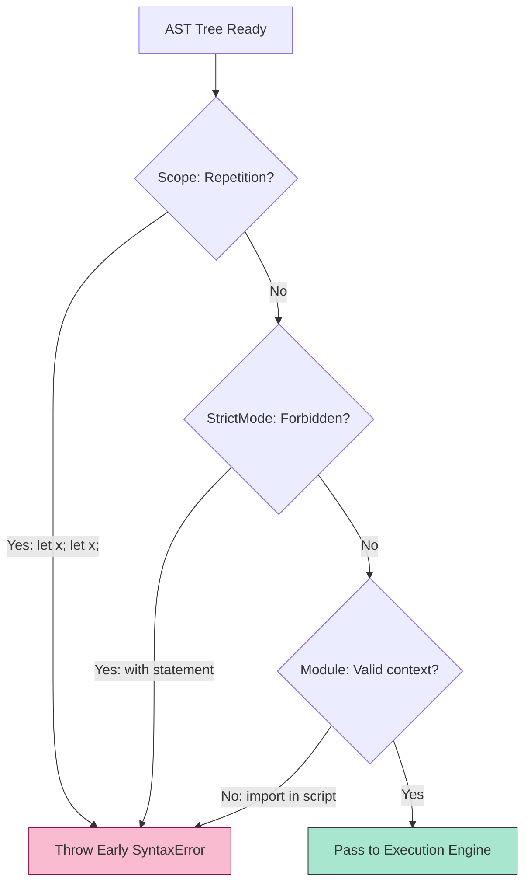

# CH-01: Static Semantics and Early Errors

> **"Kesesuaian dan Validasi Statis. `Static Semantics and Early Errors` membedah satpam intelektual Hub yang memproses integritas kode sebelum energi (runtime) dilepaskan ke sirkuit."**

**Source Hub**: 
- [ECMA-262: Static Semantic Rules](https://tc39.es/ecma262/#sec-static-semantic-rules)
- [ECMA-262: Strict Mode of ECMAScript](https://tc39.es/ecma262/#sec-strict-mode-of-ecmascript)

---

## 1. Konsep & Esensi

**Definisi Arsitek**:
Setelah kode lolos dari filter Grammar (Syntax), Hub menjalankan serangkaian **Static Semantic Rules**. Jika aturan ini dilanggar, Hub melempar **Early SyntaxError**. Tidak seperti runtime error, Early Error bersifat fatal bagi seluruh unit kode (Script/Module); tidak ada satu pun baris kode yang akan dieksekusi jika gerbang ini mendeteksi kegagalan.

**Model Mental**:
- **Grammar**: Memeriksa apakah sirkuit tersambung secara fisik.
- **Static Semantics**: Memeriksa apakah voltase dan komponennya masuk akal secara logika. Jika Anda memasang dua baterai (Variable Declaration) dengan kutub yang sama (Duplicate Name) di satu jalur, Hub akan mematikan daya sebelum sirkuit terbakar.

---

## 2. Visualisasi Sistem: Semantic Validation Gate (Clause 5.1)

### Script vs Module Static Constraints
| Feature | Script Mode | Module Mode |
| :--- | :--- | :--- |
| `import`/`export` | Forbidden (SyntaxError) | Required for ESM |
| `this` top-level | `globalThis` | `undefined` |
| `StrictMode` | Optional | Always ON (Implicit) |
| Duplicate `const` | Forbidden | Forbidden |

---

## 3. Mekanisme & Hubungan

### Tipologi Validasi (Clause 5.1.1)
1. **Early Error Detection**: Aturan spesifik yang dinyatakan dengan "It is a Syntax Error if...". Contoh: menggunakan `await` di level top-level sebuah Script (bukan Module).
2. **Lexical Binding Validation**: Memastikan tidak ada tabrakan nama variabel di dalam scope yang sama. Hub memetakan seluruh nama di **Environment Record** secara statis sebelum eksekusi dimulai.
3. **Strict Mode Constraints**: Menambahkan filter tambahan, seperti pelarangan kata kunci `with`, penghapusan variabel menggunakan `delete`, dan parameter fungsi duplikat.
4. **Binding Initialization Check**: Mendeteksi penggunaan variabel sebelum deklarasi (Temporal Dead Zone) secara parsial melalui analisis statis.

### Arsitek Mindset: Static Pre-emption
- Manfaatkan **Static Semantics** sebagai jaring pengaman utama. Dengan menggunakan `type="module"` atau `"use strict"`, Anda mengaktifkan ribuan filter validasi tambahan yang membantu mendeteksi kesalahan arsitektural di tahap pengembangan, bukan di tahap produksi yang kritis.

---

## 4. Lab Praktis
Buka file `examples/static_semantics_lab.js` untuk melihat bagaimana Hub menolak eksekusi file secara instan saat mendeteksi deklarasi `const` ganda, meskipun kesalahan tersebut berada di baris paling akhir.

---
*Status: [status.md](../../../../../status.md)*
