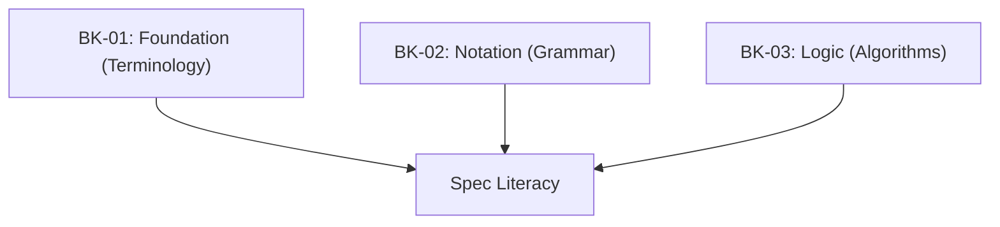

# SR-01: Spec Algorithm Conventions (The Foundation)

> **"Kunci utama untuk membuka gerbang spesifikasi. SR-01 membedah 'Konvensi Algoritma' (The Foundation)—sistem notasi dan logika yang digunakan oleh ECMA-262 untuk mendefinisikan setiap perilaku di dalam Hub."**

**Source Hub**: 
- [ECMA-262: Notational Conventions](https://tc39.es/ecma262/#sec-notational-conventions)
- [ECMA-262: Algorithm Conventions](https://tc39.es/ecma262/#sec-algorithm-conventions)

---

## 🏗️ The 3 Pillars of Spec Rigor

---

## Koleksi Buku:
1.  **[BK-01: Spec Foundations](./BK-01_SpecFoundations/)**: Terminologi dasar dan struktur spesifikasi.
2.  **[BK-02: Grammar Notation System](./BK-02_GrammarNotationSystem/)**: Notasi tata bahasa (Terminal vs Nonterminal).
3.  **[BK-03: Spec Algorithm Conventions](./BK-03_SpecAlgorithmConventions/)**: Logika eksekusi, Record, dan Matematika Spec.

---
*Status: [status.md](../../status.md) | Back to [RAK-04](../README.md)*
