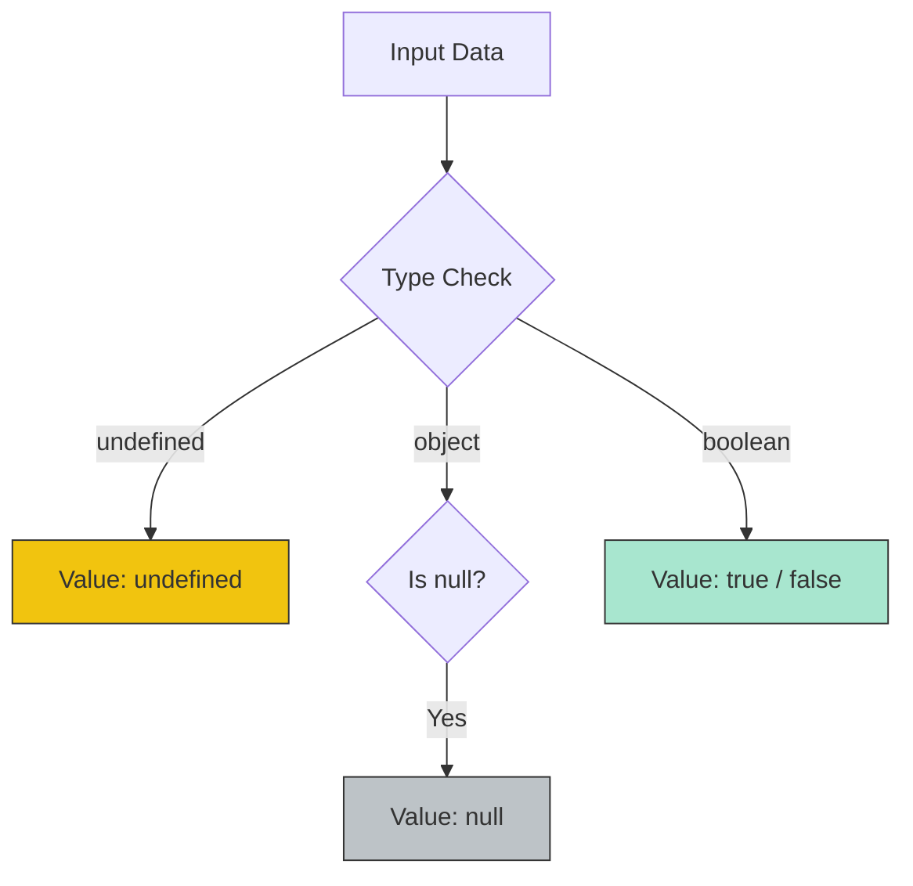

# CH-01: Primitive Types Basics

> **"Fondasi dasar dari setiap aliran data. `Primitive Types Basics` adalah unit energi terkecil yang tidak memiliki struktur internal kompleks namun sangat krusial bagi logika Hub."**

**Source Hub**: 
- [ECMA-262: The Undefined Type](https://tc39.es/ecma262/#sec-ecmascript-language-types-undefined-type)
- [ECMA-262: The Null Type](https://tc39.es/ecma262/#sec-ecmascript-language-types-null-type)
- [ECMA-262: The Boolean Type](https://tc39.es/ecma262/#sec-ecmascript-language-types-boolean-type)

---

## 1. Konsep & Esensi

**Definisi Arsitek**:
Tipe Primitif adalah data yang bukan merupakan objek dan tidak memiliki metode. Di tingkat spesifikasi, tipe ini adalah nilai atomik. Tiga yang paling dasar adalah: **Undefined** (Ketiadaan nilai secara tidak sengaja/default), **Null** (Ketiadaan nilai secara sengaja), dan **Boolean** (Logika biner: true/false).

**Model Mental**:
- **Undefined**: Sebuah slot di Hub yang kabelnya belum dicolokkan sama sekali.
- **Null**: Sebuah slot yang sengaja kita colokkan ke "Ground" (Bumi) untuk menandakan tidak ada energi.
- **Boolean**: Saklar lampu: Hanya bisa On atau Off.

---

## 2. Visualisasi Sistem: Primitive Value Distribution

---

## 3. Mekanisme & Hubungan

### Karakteristik Unik
1. **Undefined (Clause 6.1.1)**: Digunakan secara otomatis oleh Hub saat variabel dideklarasikan tanpa nilai. Mewakili status "Belum Diinisialisasi".
2. **Null (Clause 6.1.2)**: Harus diberikan secara eksplisit. Meskipun secara teknis primitif, `typeof null` mengembalikan `"object"` (sebuah anomali sejarah yang tetap dipertahankan demi stabilitas Grid).
3. **Boolean (Clause 6.1.3)**: Memiliki tepat dua nilai: `true` dan `false`. Digunakan sebagai bahan bakar utama untuk operasi kondisional.

### Arsitek Mindset: Defensive Coding
- Gunakan `null` saat Anda ingin secara sadar memberitahu sistem bahwa sebuah nilai "Kosong". Biarkan `undefined` hanya untuk indikasi bawaan sistem. Ini membuat debugging sirkuit Hub Anda jauh lebih mudah.

---

## 4. Lab Praktis
Buka file `examples/primitive_basics_lab.js` untuk melihat bagaimana Hub memperlakukan `undefined` vs `null` dalam perbandingan longgar (`==`) dan ketat (`===`).

---
*Status: [status.md](../../../../../status.md)*
