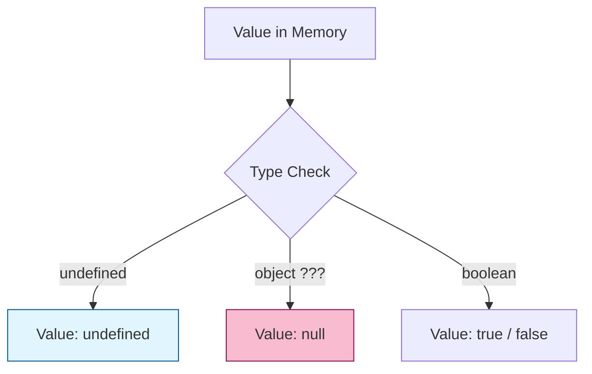

# CH-01: Undefined, Null, dan Boolean

> **"Trinitas Primitif Sederhana. `Undefined, Null, dan Boolean` membedah tipe data paling dasar di Hub yang berfungsi sebagai sinyal kehadiran, ketiadaan, dan kebenaran sirkuit."**

**Source Hub**: 
- [ECMA-262: The Undefined Type](https://tc39.es/ecma262/#sec-ecmascript-language-types-undefined-type)
- [ECMA-262: The Null Type](https://tc39.es/ecma262/#sec-ecmascript-language-types-null-type)
- [ECMA-262: The Boolean Type](https://tc39.es/ecma262/#sec-ecmascript-language-types-boolean-type)

---

## 1. Konsep & Esensi

**Definisi Arsitek**:
Tiga tipe ini adalah **Singleton Types** di level spesifikasi—masing-masing hanya memiliki satu atau dua nilai unik. 
- **Undefined**: Menandakan variabel yang belum dialiri daya (uninitialized).
- **Null**: Menandakan ketiadaan nilai secara sengaja (intentional vacuum).
- **Boolean**: Switch logika biner (`true`/`false`).

---

## 2. Visualisasi Sistem: Primitive Identity

---

## 3. Mekanisme & Hubungan

### Karakteristik Unik (Clause 6.1.1 - 6.1.3)
1. **The `typeof` Anomaly**: `typeof null` menghasilkan `"object"`. Secara arsitektural, ini adalah bug warisan (legacy) yang tidak diperbaiki demi menjaga kompatibilitas sirkuit lama di Hub.
2. **Falsy values**: `undefined`, `null`, dan `false` semuanya dievaluasi sebagai `false` di dalam konteks kontrol aliran (Abstract Operation: `ToBoolean`).
3. **Intentional vs Accidental**: Gunakan `null` saat Anda ingin "mematikan" sebuah referensi secara eksplisit. Biarkan `undefined` menjadi tugas Hub untuk menandakan variabel yang baru lahir.

---

## 4. Lab Praktis
Buka file `examples/primitive_identity_lab.js` untuk menguji perbedaan ketat antara `null` dan `undefined` dalam operasi perbandingan dan tipe data.

---
*Status: [status.md](../../../../../status.md)*
