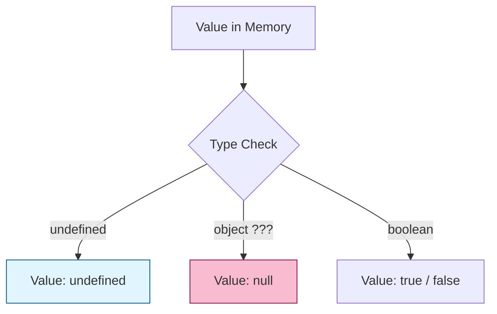

# CH-01: Undefined, Null, dan Boolean

> **"Trinitas Primitif Sederhana. `Undefined, Null, dan Boolean` membedah tipe data paling dasar di Hub yang berfungsi sebagai sinyal kehadiran, ketiadaan, dan kebenaran sirkuit."**

**Source Hub**: 
- [ECMA-262: The Undefined Type](https://tc39.es/ecma262/#sec-ecmascript-language-types-undefined-type)
- [ECMA-262: The Null Type](https://tc39.es/ecma262/#sec-ecmascript-language-types-null-type)
- [ECMA-262: The Boolean Type](https://tc39.es/ecma262/#sec-ecmascript-language-types-boolean-type)

---

## 1. Konsep & Esensi

**Definisi Arsitek**:
Tiga tipe ini adalah **Singleton Types** di level spesifikasi—masing-masing hanya memiliki satu atau dua nilai unik. 
- **Undefined**: Menandakan variabel yang belum dialiri daya (uninitialized).
- **Null**: Menandakan ketiadaan nilai secara sengaja (intentional vacuum).
- **Boolean**: Switch logika biner (`true`/`false`).

---

## 2. Visualisasi Sistem: Primitive Identity

---

## 3. Mekanisme & Hubungan

### Karakteristik Unik (Clause 6.1.1 - 6.1.3)
1. **The `typeof` Anomaly**: `typeof null` menghasilkan `"object"`. Secara arsitektural, ini adalah bug warisan (legacy) dari versi awal Hub yang tetap dipertahankan demi stabilitas sirkuit global.
2. **Abstract Operation: ToBoolean**: Hampir seluruh entitas di Hub dapat dipaksa menjadi Boolean. Nilai *falsy* (seperti `null`, `undefined`, `0`, `""`) akan memutus aliran logika jika digunakan dalam struktur kontrol.
3. **Intentional vs Accidental**: Arsitek Hub menggunakan `null` untuk merepresentasikan kekosongan yang direncanakan, sementara `undefined` seringkali muncul secara otomatis pada slot memori yang belum diisi.

---

## 4. Arsitek Mindset
Gunakan `null` sebagai penanda eksplisit bahwa sebuah komponen memori sengaja dikosongkan. Hindari penggunaan `undefined` secara manual; biarkan Hub yang memberikannya sebagai sinyal bahwa sesuatu memang belum pernah diinisialisasi.

---

## 5. Lab Praktis
Eksperimen di folder `examples/` membedah dua pilar utama:
1.  **[Identity & Comparison](./examples/01_identity_comparison.js)**: Membuktikan perbedaan fundamental antara `null` dan `undefined`.
2.  **[ToBoolean Audit](./examples/02_toboolean_audit.js)**: Menjelajahi daftar *falsy values* dan kejutan pada *truthy values*.

---
*Status: [status.md](../../../../../status.md)*
