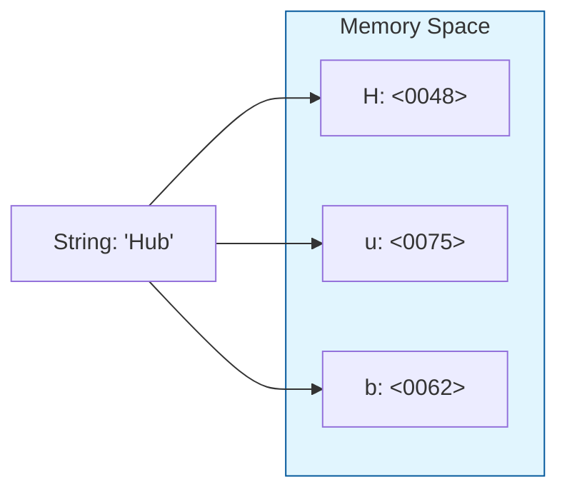

# CH-02: String and Text Processing

> **"Energi yang berbentuk narasi. `String and Text Processing` adalah cara Hub mengelola, mencari, dan memanipulasi rentetan karakter Unicode."**

**Source Hub**: 
- [ECMA-262: The String Type](https://tc39.es/ecma262/#sec-ecmascript-language-types-string-type)
- [MDN: String Operations](https://developer.mozilla.org/en-US/docs/Web/JavaScript/Reference/Global_Objects/String)

---

## 1. Konsep & Esensi

**Definisi Arsitek**:
Tipe **String** dalam JavaScript adalah urutan 16-bit nilai Integer yang tidak bertanda. Meskipun terlihat seperti teks biasa, di balik layar ia adalah sekumpulan **UTF-16 Code Units**. Setiap elemen dalam string menempati posisi (index) yang dimulai dari 0.

**Model Mental**:
Bayangkan sebuah ban berjalan (conveyor belt) di Hub. Setiap kotak di atasnya berisi satu karakter Unicode. Anda bisa memotong ban tersebut, menggabungkannya, atau mencari pola kotak tertentu.

---

## 2. Visualisasi Sistem: String Internal Memory

---

## 3. Mekanisme & Hubungan

### Operasi Pencarian Internal
1. **Indexing**: String bersifat *Immutable* (tidak bisa diubah). Setiap kali Anda "mengubah" string, Hub sebenarnya menciptakan ban berjalan baru dengan data yang dimodifikasi.
2. **Search Operations**: Melibatkan algoritma penelusuran linear untuk menemukan sub-string.
3. **Template Literals**: Mekanisme canggih untuk interpolasi energi (variabel) langsung ke dalam sirkuit teks.

### Arsitek Mindset: Immutable Efficiency
- Karena string bersifat immutable, Hub bisa melakukan optimasi "String Interning" (berbagi memori untuk string yang sama). Gunakan ini untuk keuntungan Anda dengan menghindari modifikasi string di dalam loop besar yang bisa membebani tim pembersih (GC).

---

## 4. Lab Praktis
Buka file `examples/string_processing_lab.js` untuk melihat perbedaan antara manipulasi string konvensional dan penggunaan Template Literals untuk efisiensi pembentukan pesan Grid.

---
*Status: [status.md](../../../../../status.md)*
