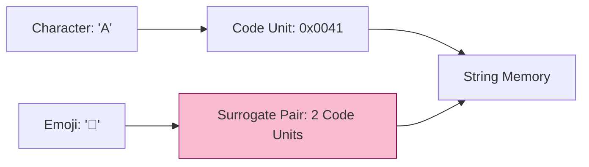

# CH-02: String and Text Processing

> **"Arsitektur Data Tekstual. `String and Text Processing` membedah bagaimana Hub mengelola urutan karakter dalam format UTF-16 dan operasi manipulasi teks tingkat tinggi."**

**Source Hub**: 
- [ECMA-262: The String Type](https://tc39.es/ecma262/#sec-ecmascript-language-types-string-type)

---

## 1. Konsep & Esensi

**Definisi Arsitek**:
Sebuah **String** di Hub adalah urutan elemen integer 16-bit (Code Units) yang mewakili teks dalam format Unicode. String bersifat **Immutable**—setiap operasi modifikasi sebenarnya menciptakan unit String baru di memori Hub tanpa merubah sirkuit aslinya.

---

## 2. Visualisasi Sistem: UTF-16 Encoding

---

## 3. Mekanisme & Hubungan

### Karakteristik Transmisi (Clause 6.1.4)
1. **Surrogate Pairs**: Untuk karakter kompleks seperti Emoji atau teks kuno, Hub menggunakan dua unit 16-bit (surrogate pair). Kesalahan dalam menghitung `length` sering terjadi karena Hub menghitung unit memori, bukan karakter visual.
2. **String Interning**: Engine Hub sering mengoptimalkan penggunaan memori dengan menyimpan hanya satu salinan untuk string yang identik, sehingga perbandingan `===` antar literal string sangatlah cepat.
3. **Normalization**: Karena satu karakter visual bisa direpresentasikan dengan berbagai cara di Unicode, Hub menyediakan metode normalisasi untuk memastikan integritas perbandingan teks.

---

## 4. Arsitek Mindset
Selalu gunakan iterasi berbasis `for...of` jika berhadapan dengan teks yang mungkin mengandung Emoji, karena iterasi ini sadar akan *Code Points*, bukan sekadar *Code Units* mentah. Ingat bahwa setiap penggabungan string besar di dalam loop dapat menyebabkan pemborosan memori akibat sifat imutabilitasnya.

---

## 5. Lab Praktis
Eksperimen di folder `examples/` membedah dua pilar utama:
1.  **[UTF-16 & Surrogates](./examples/01_utf16_surrogates.js)**: Demonstrasi bahaya menghitung `length` pada karakter kompleks.
2.  **[Immutability & Interning](./examples/02_immutability_interning.js)**: Membuktikan bahwa string tidak bisa diubah dan bagaimana engine melakukan optimasi referensi.

---
*Status: [status.md](../../../../../status.md)*
