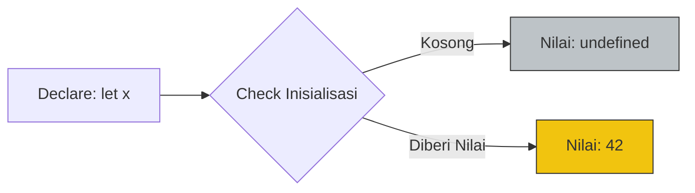

# CH-02: The Undefined Type

> **"Kekosongan yang terdefinisi. Undefined adalah sinyal dari Grid bahwa sebuah variabel telah dideklarasikan namun dayanya belum dialirkan."**

**Source Hub**: 
- [MDN: Undefined Type](https://developer.mozilla.org/en-US/docs/Web/JavaScript/Reference/Global_Objects/undefined)
- [ECMA-262: The Undefined Type](https://tc39.es/ecma262/#sec-ecmascript-language-types-undefined-type)

---

## 1. Konsep & Esensi

**Definisi Arsitek**:
Tipe **Undefined** dalam ECMAScript adalah tipe data yang hanya memiliki satu nilai tunggal: `undefined`. Berbeda dengan `null`, `undefined` secara otomatis diberikan oleh engine ke variabel yang baru dideklarasikan tanpa nilai awal, atau saat mengakses properti yang tidak ada di dalam objek.

**Model Mental**:
Bayangkan sebuah kotak di gudang Hub yang sudah diberi label rak nama, tetapi di dalamnya masih kosong melompong (belum diisi barang). Labelnya ada (`Declare`), isinya tidak ada (`Undefined`).

---

## 2. Visualisasi Sistem: Alur Inisialisasi

---

## 3. Mekanisme & Hubungan

### Kapan `undefined` Muncul (Mekanisme Engine):
1. **Variabel Tanpa Nilai**: Variabel yang dideklarasikan dengan `let`, `var`, atau `const` (const harus diisi, tapi secara spek ada fase TDZ/undefined).
2. **Missing Arguments**: Parameter fungsi yang tidak diisi oleh pemanggil.
3. **Implicit Return**: Fungsi yang tidak memiliki statemen `return` akan secara implisit mengembalikan `undefined`.
4. **Missing Properties**: Mengakses properti objek yang tidak terdaftar di dalam struktur aslinya.

### Arsitek Mindset:
- Jangan gunakan `undefined` untuk menghapus nilai; biarkan engine yang mengelolanya. Gunakan `null` jika Anda ingin menyatakan "Sengaja Kosong".
- Periksa `typeof x === 'undefined'` untuk keamanan sebelum melakukan operasi pada variabel global yang mungkin belum ada.

---

## 4. Lab Praktis
Buka file `examples/undefined_states.js` untuk bereksperimen dengan berbagai kondisi yang menghasilkan nilai `undefined` dan cara menangannya di level Grid.

---
*Status: [status.md](../../../../../status.md)*
