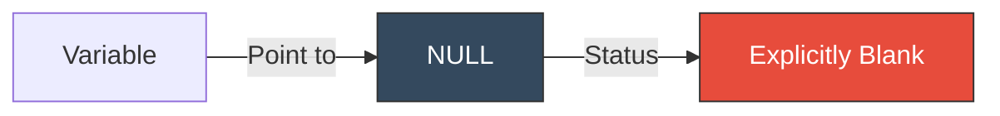

# CH-03: The Null Type

> **"Sengaja ditiadakan. Null adalah sinyal eksplisit dari arsitek bahwa sebuah koneksi atau objek memang seharusnya kosong (Intentional Void)."**

**Source Hub**: 
- [MDN: null](https://developer.mozilla.org/en-US/docs/Web/JavaScript/Reference/Operators/null)
- [ECMA-262: The Null Type](https://tc39.es/ecma262/#sec-ecmascript-language-types-null-type)

---

## 1. Konsep & Esensi

**Definisi Arsitek**:
Tipe **Null** dalam ECMAScript adalah tipe data yang hanya memiliki satu nilai tunggal: `null`. Berbeda dengan `undefined` yang bersifat implisit (belum diisi), `null` bersifat eksplisit (sengaja dikosongkan). Ini sering digunakan sebagai *sentinel value* untuk menandai bahwa sebuah objek atau hasil operasi saat ini tidak ada.

**Model Mental**:
Bayangkan sebuah lahan parkir yang sudah ada nomornya, tetapi Anda memasang papan bertanda "Sengaja Kosong" (Intentional Blank) di sana untuk menandakan bahwa memang tidak ada mobil yang boleh parkir di sana sekarang.

---

## 2. Visualisasi Sistem: Intentional Void

---

## 3. Mekanisme & Hubungan

### Fitur Utama & Sentinel Value
- **Sentinel Value**: Digunakan dalam logika pemrograman untuk menandai "akhir dari pencarian" atau hasil "tidak ditemukan" pada API yang mengharapkan objek.
- **Prototype Chain**: Ujung dari setiap rantai prototype di JavaScript adalah `null`. `Object.prototype.__proto__ === null`.
- **Legacy Bug**: `typeof null` mengembalikan `"object"`. Ini adalah bug desain dari tahun 1995 yang tetap dipertahankan demi kompatibilitas web.

### Arsitek Mindset: Semantic Clarity
- Gunakan `null` saat Anda ingin secara eksplisit menyatakan bahwa sebuah properti atau variabel **seharusnya berisi objek** namun saat ini sedang kosong.
- Jangan tertukar dengan `undefined`; `null` adalah ketiadaan nilai objek (*absence of any object value*), sedangkan `undefined` adalah ketiadaan inisialisasi (*absence of initialization*).

---

## 4. Lab Praktis
Buka file `examples/null_intent.js` untuk mengeksperimenkan penggunaan `null` sebagai sentinel value dan melihat perilakunya di dalam rantai prototype.

---
*Status: [status.md](../../../../../status.md)*
