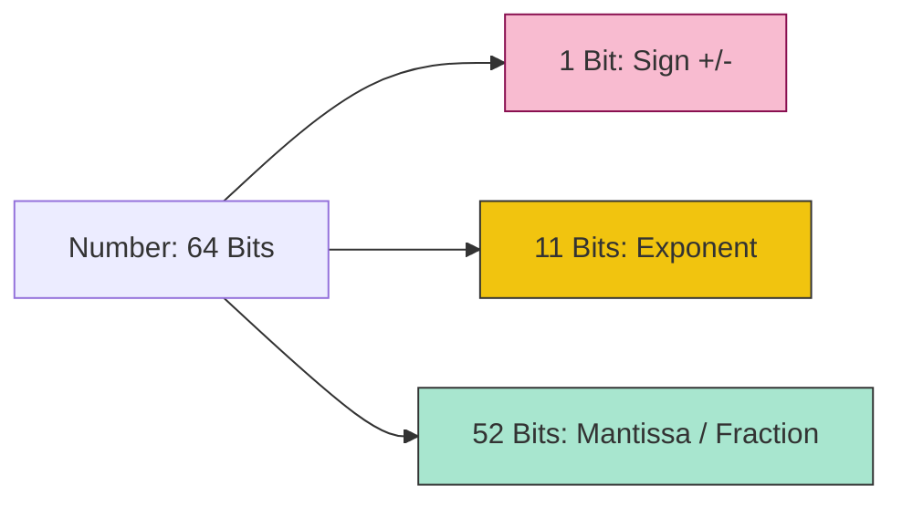

# CH-01: The Number Type & IEEE 754

> **"Arsitektur Floating Point 64-bit. `The Number Type & IEEE 754` membedah bagaimana Hub menyimpan nilai numerik dalam format biner yang presisi namun memiliki batasan fisik."**

**Source Hub**: 
- [ECMA-262: The Number Type](https://tc39.es/ecma262/#sec-ecmascript-language-types-number-type)
- [IEEE 754-2019 Standard](https://ieeexplore.ieee.org/document/8766229)

---

## 1. Konsep & Esensi

**Definisi Arsitek**:
Tipe **Number** di Hub adalah nilai floating-point format biner 64-bit (double precision) sesuai standar **IEEE 754**. Ia mencakup nilai khusus seperti `NaN` (Not-a-Number), `+Infinity`, `-Infinity`, dan dua jenis nol: `+0` dan `-0`.

**Model Mental**:
- **Number**: Sebuah penggaris digital 64-bit. Sangat akurat untuk angka menengah, tapi mulai "kehilangan detail" (precision loss) pada angka yang sangat besar atau sangat kecil.

---

## 2. Visualisasi Sistem: 64-bit Bit Distribution

---

## 3. Mekanisme & Hubungan

### Gejala Presisi (Clause 6.1.6.1)
1. **Precision Loss**: Nilai `0.1 + 0.2` tidak sama dengan `0.3` karena representasi biner 0.1 dan 0.2 adalah pecahan tak terbatas yang dipotong paksa oleh mantissa 52-bit.
2. **Safe Integers**: Batas aman angka bulat di Hub adalah 2^53 - 1 (`Number.MAX_SAFE_INTEGER`). Di atas itu, satu bit mantissa mulai hilang, menyebabkan angka-angka yang berbeda terlihat sama.
3. **The Two Zeros**: `+0` dan `-0` dianggap sama secara perbandingan (`===`), tapi berbeda secara perilaku saat digunakan sebagai pembagi (menghasilkan `+Infinity` vs `-Infinity`).

### Arsitek Mindset: Floating Point Awareness
- Jangan pernah membandingkan hasil kalkulasi floating point secara langsung (`a === b`). Selalu gunakan ambang batas toleransi (Epsilon) untuk memastikan sirkuit logika Anda tahan terhadap error presisi biner Hub.

---

## 4. Lab Praktis
Buka file `examples/number_precision_lab.js` untuk membuktikan batas `MAX_SAFE_INTEGER` dan melakukan audit perilaku terhadap nilai khusus `NaN` dan `Signed Zero`.

---
*Status: [status.md](../../../../../status.md)*
