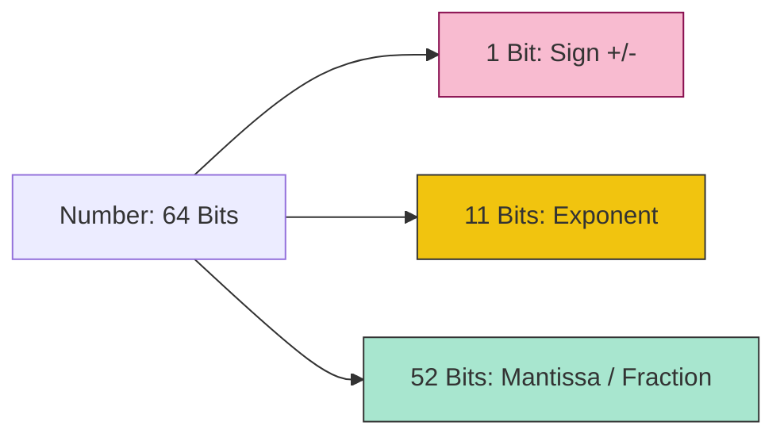

# CH-01: The Number Type & IEEE 754

> **"Arsitektur Floating Point 64-bit. `The Number Type & IEEE 754` membedah bagaimana Hub menyimpan nilai numerik dalam format biner yang presisi namun memiliki batasan fisik."**

**Source Hub**: 
- [ECMA-262: The Number Type](https://tc39.es/ecma262/#sec-ecmascript-language-types-number-type)

---

## 1. Konsep & Esensi

**Definisi Arsitek**:
Tipe **Number** di Hub adalah nilai floating-point format biner 64-bit (double precision) sesuai standar **IEEE 754**. Ia mencakup nilai khusus seperti `NaN` (Not-a-Number), `+Infinity`, `-Infinity`, dan dua jenis nol: `+0` dan `-0`.

---

## 2. Visualisasi Sistem: 64-bit Bit Distribution

---

## 3. Mekanisme & Hubungan

### Gejala Presisi (Clause 6.1.6.1)
1.  **Bit-Level Representation**: Setia angka di Hub sebenarnya adalah kombinasi dari 1 bit tanda, 11 bit eksponen, dan 52 bit mantissa (fraksi).
2.  **Precision Loss**: Karena mantissa hanya memiliki 52 bit, angka desimal seperti 0.1 tidak bisa direpresentasikan secara sempurna dalam biner. Inilah alasan `0.1 + 0.2` tidak tepat `0.3`—terjadi pemotongan energi di level bit terkecil.
3.  **Safe Integers**: Batas aman angka bulat di Hub adalah 2^53 - 1 (`Number.MAX_SAFE_INTEGER`). Di atas batas ini, Hub mulai mengorbankan bit mantissa untuk eksponen, menyebabkan angka yang berbeda terlihat sama (Collision).

---

## 4. Arsitek Mindset
Jangan gunakan tipe `Number` untuk operasi finansial atau ID database yang sangat besar karena risiko kehilangan presisi. Selalu audit sirkuit numerik Anda menggunakan `Number.isSafeInteger()` jika integritas data adalah prioritas utama.

---

## 5. Lab Praktis
Eksperimen di folder `examples/` membedah dua pilar utama:
1.  **[Bit Distribution](./examples/01_bit_distribution.js)**: Membedah struktur Hex dan Biner dari nilai-nilai khusus Hub.
2.  **[Precision Audit](./examples/02_precision_audit.js)**: Demonstrasi kegagalan presisi pada mantissa dan batas aman integer.

---
*Status: [status.md](../../../../../status.md)*
