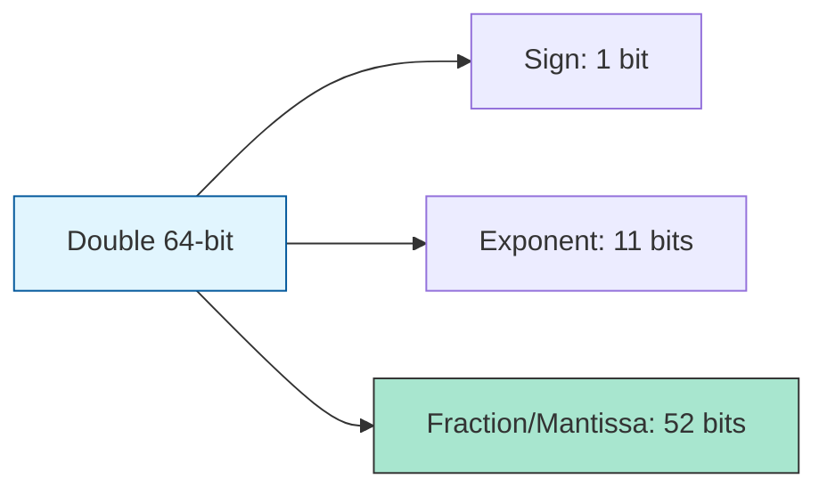

# CH-01: The Number Type (IEEE 754)

> **"Presisi dalam keterbatasan sirkuit. `The Number Type` adalah implementasi standar IEEE 754 64-bit yang menjadi motor utama perhitungan di Hub."**

**Source Hub**: 
- [ECMA-262: The Number Type](https://tc39.es/ecma262/#sec-ecmascript-language-types-number-type)
- [IEEE 754 Standard](https://ieeexplore.ieee.org/document/8766229)

---

## 1. Konsep & Esensi

**Definisi Arsitek**:
Semua angka reguler di JavaScript adalah **Double Precision 64-bit Binary Format IEEE 754 values**. Tipe ini memiliki nilai khusus: **+Infinity**, **-Infinity**, dan **NaN** (*Not-a-Number*). Memahami bahwa ini adalah sistem *Floating Point* sangat krusial untuk menghindari *rounding errors*.

**Model Mental**:
Bayangkan sebuah penggaris dengan skala yang sangat detail di tengah, tapi semakin kasar di ujung-ujungnya. Anda bisa mengukur debu dengan sangat presisi, tapi saat mengukur jarak antar bintang, Anda akan kehilangan beberapa milimeter (presisi).

---

## 2. Visualisasi Sistem: IEEE 754 Components

---

## 3. Mekanisme & Hubungan

### Nilai-Nilai Sakral
1. **NaN (Not-a-Number)**: Mewakili hasil operasi matematika yang tidak terdefinisi (misal: `0 / 0`). Ciri unik: `NaN !== NaN`.
2. **Positive/Negative Zero**: Hub membedakan `+0` dan `-0`. Hal ini penting dalam beberapa perhitungan fisik dan pembagian dengan tak terhingga.
3. **Precision Limits**: Angka integer aman hanya sampai 2^53 - 1 (`Number.MAX_SAFE_INTEGER`). Di atas itu, Hub akan mulai membulatkan angka.

### Arsitek Mindset: Precision Awareness
- Selalu gunakan `Number.EPSILON` saat membandingkan dua angka desimal untuk menghindari jebakan `0.1 + 0.2 === 0.3` yang akan selalu menghasilkan `false`.

---

## 4. Lab Praktis
Buka file `examples/number_precision_lab.js` untuk melihat bagaimana Hub menangani limitasi IEEE 754 dan cara melakukan perbandingan angka desimal yang aman.

---
*Status: [status.md](../../../../../status.md)*
