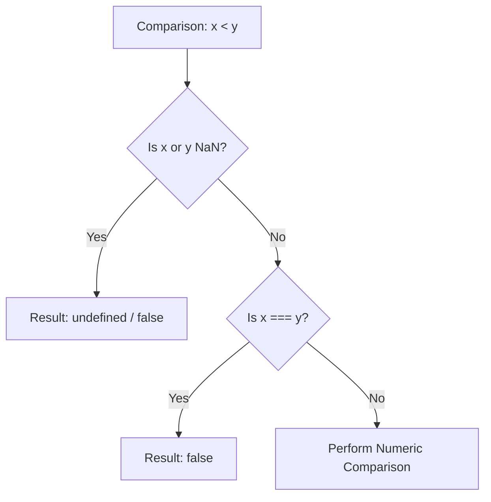

# CH-02: Number Arithmetic and Comparison

> **"Aliran Energi Numerik. `Number Arithmetic and Comparison` membedah algoritma operasi matematika dan perbandingan yang mengatur aliran data di dalam Hub."**

**Source Hub**: 
- [ECMA-262: Numeric Types Operations](https://tc39.es/ecma262/#sec-numeric-types-operations)

---

## 1. Konsep & Esensi

**Definisi Arsitek**:
Operasi pada Number di Hub bukan sekadar matematika biasa, melainkan implementasi dari **Abstract Operations** sesuai aturan ketat IEEE 754. Setiap operasi menangani nilai khusus (NaN, Infinity) secara deterministik untuk menjamin stabilitas Agent Hub di seluruh ekosistem.

---

## 2. Visualisasi Sistem: Relational Logic Flow

---

## 3. Mekanisme & Hubungan

### Aturan Operasi (Clause 6.1.6.1.1 - 6.1.6.1.20)
1.  **NaN Poisoning**: `NaN` bertindak seperti agen "beracun". Sekali sirkuit terkontaminasi oleh NaN, hampir seluruh operasi lanjutannya akan menghasilkan NaN juga.
2.  **The Two Zeros (`+0` vs `-0`)**: Hub memiliki dua kutub nol. Meskipun `+0 === -0` bernilai benar, mereka menghasilkan energi yang berbeda saat digunakan sebagai pembagi (menghasilkan Infinity vs -Infinity).
3.  **Relational Comparison**: Algoritma `Abstract Relational Comparison` akan mengembalikan `undefined` jika salah satu sisi adalah `NaN`, yang secara efektif berarti perbandingan tersebut gagal dijalankan.

---

## 4. Arsitek Mindset
Gunakan `Object.is()` untuk membedakan `+0` dan `-0` jika sirkuit Anda sensitif terhadap polaritas arah numerik. Pastikan untuk selalu memvalidasi input dengan `isNaN()` sebelum melakukan operasi matematika berantai untuk menghindari "keracunan" data.

---

## 5. Lab Praktis
Eksperimen di folder `examples/` membedah dua pilar utama:
1.  **[NaN Poisoning](./examples/01_nan_poisoning.js)**: Melacak bagaimana satu nilai rusak menghancurkan seluruh hasil perhitungan.
2.  **[Relational Logic](./examples/02_relational_logic.js)**: Audit mendalam terhadap perbandingan angka vs karakter string.

---
*Status: [status.md](../../../../../status.md)*
