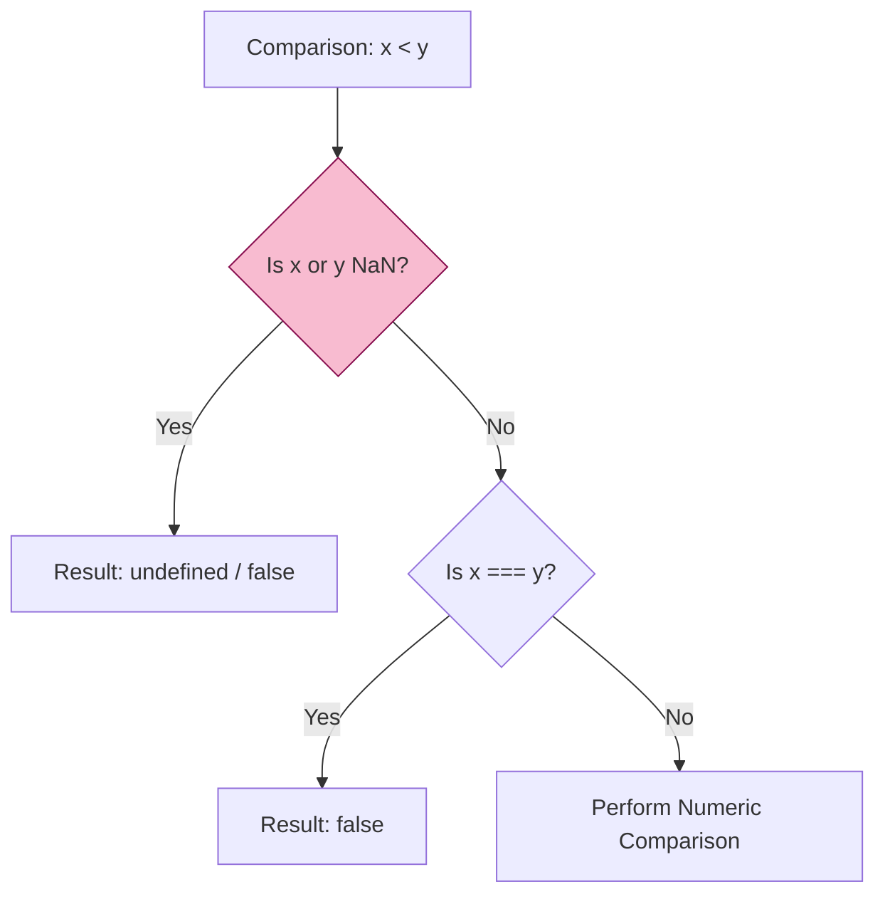

# CH-02: Number Arithmetic and Comparison

> **"Aliran Energi Numerik. `Number Arithmetic and Comparison` membedah algoritma operasi matematika dan perbandingan yang mengatur aliran data di dalam Hub."**

**Source Hub**: 
- [ECMA-262: Numeric Types Operations](https://tc39.es/ecma262/#sec-numeric-types-operations)
- [ECMA-262: Abstract Relational Comparison](https://tc39.es/ecma262/#sec-abstract-relational-comparison)

---

## 1. Konsep & Esensi

**Definisi Arsitek**:
Operasi pada Number di Hub bukan sekadar matematika biasa, melainkan implementasi dari **Abstract Operations** (seperti `Number::add`, `Number::lessThan`). Setiap operasi menangani nilai khusus (NaN, Infinity) sesuai aturan ketat IEEE 754 untuk menjamin hasil yang deterministik di seluruh Agent Hub.

**Model Mental**:
- **Arithmetic**: Transformator energi. Input masuk, diproses oleh aturan IEEE, dan keluar sebagai output baru.
- **Comparison**: Sensor gerbang. Menentukan apakah jalur data tertentu boleh aktif berdasarkan relasi besaran.

---

## 2. Visualisasi Sistem: Relational Logic Flow

---

## 3. Mekanisme & Hubungan

### Aturan Operasi (Clause 6.1.6.1.1 - 6.1.6.1.20)
1. **NaN Contamination**: Hampir setiap operasi yang melibatkan `NaN` akan menghasilkan `NaN`. Ia bertindak sebagai "racun" yang menghentikan validitas sirkuit numerik.
2. **Division by Zero**: Berbeda dengan bahasa lain yang melempar error, Hub mengembalikan `Infinity` atau `-Infinity`. Sirkuit tidak mati, tapi datanya meluap (overflow).
3. **Rounding (Ties to Even)**: Saat sebuah hasil berada tepat di tengah dua angka yang bisa direpresentasikan, Hub membulatkannya ke angka genap terdekat di level bit.

### Arsitek Mindset: Deterministic Arithmetic
- Pahami bahwa urutan operasi memengaruhi hasil. Karena presisi terbatas, `(a + b) + c` mungkin tidak sama dengan `a + (b + c)`. Selalu desain algoritma finansial atau ilmiah Anda dengan memperhatikan urutan akumulasi error pembulatan.

---

## 4. Lab Praktis
Buka file `examples/arithmetic_edge_cases.js` untuk mengamati perilaku "beracun" dari NaN dan bagaimana pembagian dengan nol (Signed Zero) menghasilkan polaritas energi yang berbeda.

---
*Status: [status.md](../../../../../status.md)*
