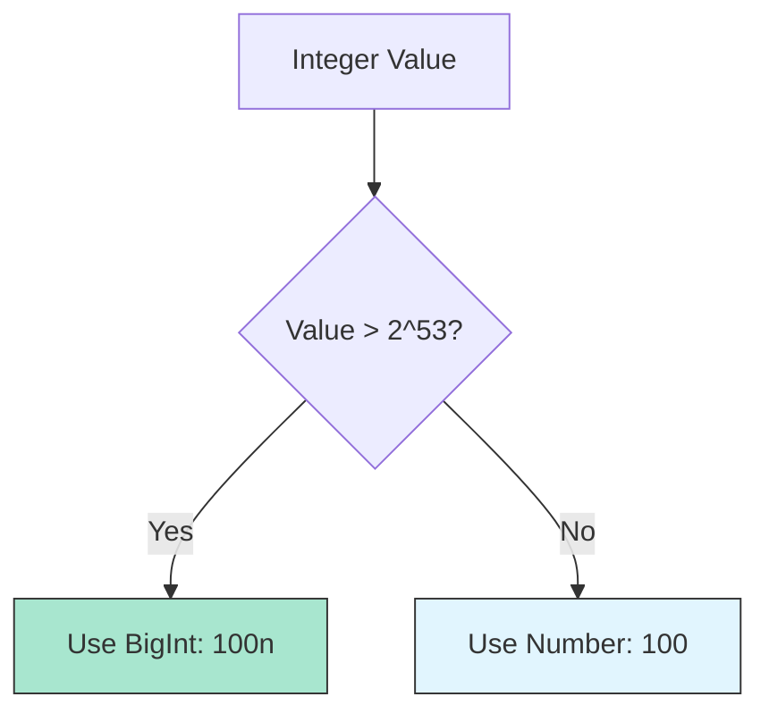

# CH-02: The BigInt Type

> **"Kapasitas tanpa batas untuk angka bulat. `The BigInt Type` menyediakan presisi absolut untuk perhitungan integer seberapa pun besarnya energi yang diolah."**

**Source Hub**: 
- [ECMA-262: The BigInt Type](https://tc39.es/ecma262/#sec-ecmascript-language-types-bigint-type)
- [MDN: BigInt](https://developer.mozilla.org/en-US/docs/Web/JavaScript/Reference/Global_Objects/BigInt)

---

## 1. Konsep & Esensi

**Definisi Arsitek**:
**BigInt** adalah tipe data numerik yang dapat mewakili sirkuit integer dengan presisi arbitrer (tidak terbatas oleh 64-bit). Berbeda dengan `Number`, BigInt tidak memiliki komponen desimal dan tidak mengenal nilai `NaN` atau `Infinity`.

**Model Mental**:
Jika `Number` adalah penggaris standar, maka `BigInt` adalah ban meteran yang bisa ditarik sepanjang apa pun tanpa kehilangan garis-garis milimeternya. Sangat cocok untuk menghitung ID transaksi perbankan atau kriptografi di dalam Grid.

---

## 2. Visualisasi Sistem: Number vs BigInt

---

## 3. Mekanisme & Hubungan

### Aturan Interaksi
1. **No Mixing**: Anda tidak boleh mencampur `Number` dan `BigInt` dalam satu operasi aritmetika (misal: `1n + 1`) karena akan menimbulkan **TypeError**. Anda harus melakukan konversi eksplisit.
2. **Division**: Pembagian pada BigInt selalu membuang sisa desimalnya (perilaku *truncate*). `5n / 2n` akan menghasilkan `2n`.
3. **Suffix**: BigInt ditandai dengan huruf `n` di akhir angka literalnya.

### Arsitek Mindset: Choice of Precision
- Gunakan `BigInt` hanya saat Anda benar-benar membutuhkan angka bulat di atas 9 kuadriliun. Untuk koordinat grafik atau perhitungan UI, tetap gunakan `Number` karena jauh lebih dioptimalkan oleh engine Hub.

---

## 4. Lab Praktis
Buka file `examples/bigint_usage_lab.js` untuk berlatih melakukan operasi matematika besar yang akan gagal jika menggunakan tipe `Number`.

---
*Status: [status.md](../../../../../status.md)*
