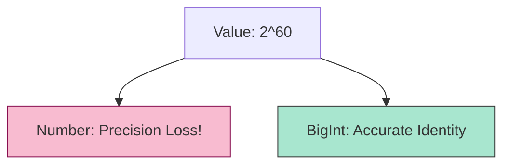

# CH-03: The BigInt Type & Operations

> **"Presisi Integer Tanpa Batas. `The BigInt Type & Operations` membedah tipe data numerik yang mampu menangani angka bulat raksasa melampaui limit fisik 64-bit."**

**Source Hub**: 
- [ECMA-262: The BigInt Type](https://tc39.es/ecma262/#sec-ecmascript-language-types-bigint-type)

---

## 1. Konsep & Esensi

**Definisi Arsitek**:
**BigInt** adalah tipe data primitif yang mewakili **Mathematical Value** berupa integer (angka bulat) dengan presisi arbiter. Tidak seperti Number, BigInt tidak memiliki batas atas atau bawah selama memori Hub masih mencukupi. Ia dirancang untuk sirkuit yang membutuhkan integritas absolut pada angka bulat besar (misal: ID Database 64-bit atau Kriptografi).

---

## 2. Visualisasi Sistem: Number vs BigInt

---

## 3. Mekanisme & Hubungan

### Aturan Isolasi (Clause 6.1.6.2)
1. **No Mixed Operations**: Hub melarang keras pencampuran BigInt dan Number dalam satu operasi (`1n + 1` melempar TypeError). Ini mencegah kehilangan presisi terselubung saat BigInt yang besar dipaksa masuk ke wadah Number yang sempit.
2. **No Unary Plus**: Operator `+` (unary plus) tidak bekerja pada BigInt karena Hub sering menggunakannya untuk konversi ke Number, yang bertentangan dengan prinsip isolasi BigInt.
3. **Integral Division**: Pembagian BigInt selalu membulat ke angka nol (truncate). Sisa bagi harus dicari menggunakan operator modulo `%`.

---

## 4. Lab Praktis
Buka file `examples/bigint_integrity_lab.js` untuk mensimulasikan kegagalan penanganan ID besar pada tipe Number dan bagaimana BigInt menyelesaikannya dengan presisi 100%.

---
*Status: [status.md](../../../../../status.md)*
