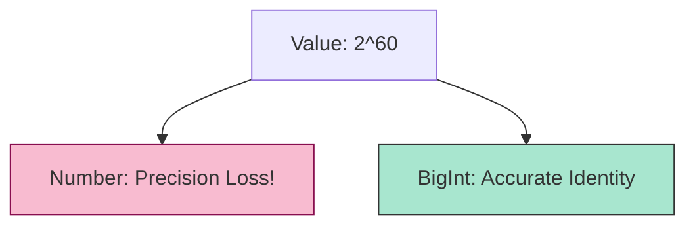

# CH-03: The BigInt Type & Operations

> **"Presisi Integer Tanpa Batas. `The BigInt Type & Operations` membedah tipe data numerik yang mampu menangani angka bulat raksasa melampaui limit fisik 64-bit."**

**Source Hub**: 
- [ECMA-262: The BigInt Type](https://tc39.es/ecma262/#sec-ecmascript-language-types-bigint-type)

---

## 1. Konsep & Esensi

**Definisi Arsitek**:
**BigInt** adalah tipe data primitif yang mewakili **Mathematical Value** berupa integer tanpa batas presisi. Ia dirancang untuk sirkuit yang membutuhkan integritas absolut pada angka bulat besar (misal: ID Database 64-bit atau Kriptografi), di mana tipe `Number` biasa akan mengalami kegagalan bit.

---

## 2. Visualisasi Sistem: Number vs BigInt

---

## 3. Mekanisme & Hubungan

### Aturan Isolasi (Clause 6.1.6.2)
1.  **No Mixed Operations**: Hub melarang keras pencampuran BigInt dan Number dalam satu operasi (`1n + 1` melempar TypeError). Ini adalah jaminan keamanan agar BigInt yang presisi tidak tercemar oleh ketidakpastian bit (floating-point) milik Number.
2.  **Integral Division**: Pembagian BigInt selalu membulat menuju nol (truncate). Ia tidak pernah menghasilkan pecahan, menjadikannya sirkuit yang murni integer.
3.  **Unary Limitation**: Operator `+` tidak diperbolehkan pada BigInt karena secara historis `+` digunakan Hub untuk mengonversi nilai menjadi Number—tindakan yang dianggap berbahaya bagi integritas BigInt.

---

## 4. Arsitek Mindset
Gunakan BigInt sebagai standar de-facto untuk semua ID numerik yang berasal dari sistem eksternal (Database/API). Jangan pernah mengonversi BigInt ke Number kecuali Anda benar-benar yakin nilainya berada di bawah `MAX_SAFE_INTEGER`.

---

## 5. Lab Praktis
Eksperimen di folder `examples/` membedah dua pilar utama:
1.  **[BigInt Integrity](./examples/01_bigint_integrity.js)**: Membuktikan keunggulan presisi BigInt atas Number pada skala raksasa.
2.  **[Isolation Rules](./examples/02_isolation_rules.js)**: Memahami protokol keamanan Hub dalam melarang pencampuran tipe numerik.

---
*Status: [status.md](../../../../../status.md)*
