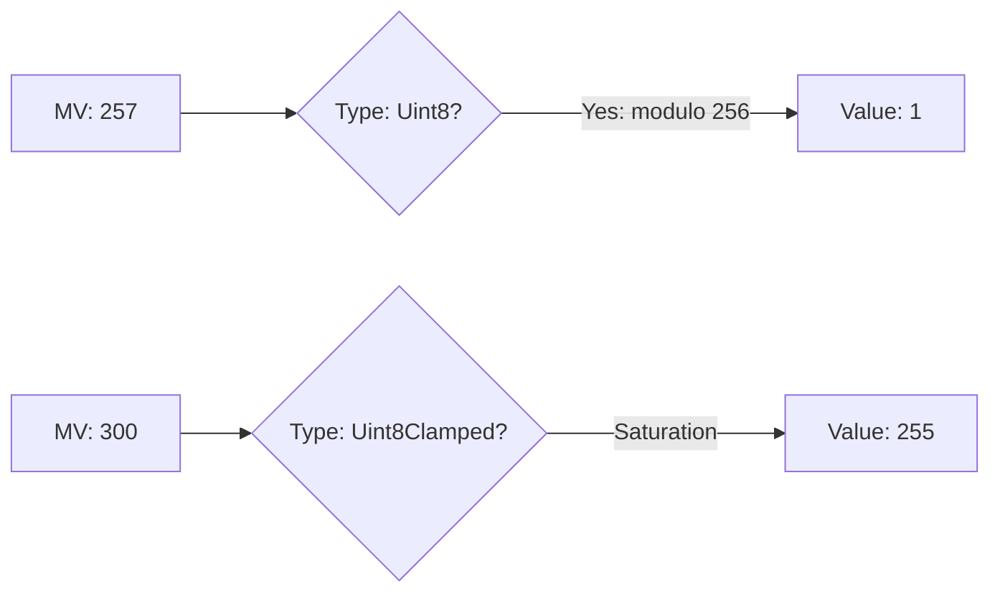

# CH-04: Mathematical Values and Clamping

> **"Jembatan Abstraksi ke Realita. `Mathematical Values and Clamping` membedah transformasi dari nilai matematika ideal menuju nilai bahasa yang terikat batas memori."**

**Source Hub**: 
- [ECMA-262: Mathematical Operations](https://tc39.es/ecma262/#sec-mathematical-operations)

---

## 1. Konsep & Esensi

**Definisi Arsitek**:
Di level terdalam Hub, spesifikasi bekerja menggunakan **Mathematical Values (MV)**—angka murni dengan presisi tak terbatas. Namun, saat nilai ini harus disimpan sebagai **Language Type** (seperti `Uint8`), Hub melakukan **Clamping** atau **Wrapping** (modul 2^n) untuk menyesuaikan nilai tersebut dengan arsitektur hardware hardware.

---

## 2. Visualisasi Sistem: The Wrapping Mechanism

---

## 3. Mekanisme & Hubungan

### Konversi Tipe Internal (Clause 6.1.6)
1.  **Modulo Wrapping**: Saat memasukkan angka yang melampaui batas ke `Uint8Array`, Hub tidak melempar error. Ia melakukan operasi sisa bagi (`value mod 256`). Ini disebut *wrapping* karena nilainya kembali berputar ke titik nol.
2.  **Clamping (Saturation)**: Berbeda dengan wrapping, `Uint8ClampedArray` melakukan *saturasi*. Jika angka melampaui 255, ia akan tertahan di 255. Jika di bawah 0, ia tertahan di 0. Ini sangat krusial dalam algoritma pemrosesan citra (Pixel data).
3.  **Mathematical Value (MV)**: MV adalah entitas abstrak di spesifikasi. Operasi seperti `1 + 1` di spesifikasi awalnya menghasilkan MV 2, baru kemudian dikonversi menjadi Number 2 atau BigInt 2n.

---

## 4. Arsitek Mindset
Pahami perbedaan antara "Wrap" dan "Clamp" saat bekerja dengan data biner atau stream audio/video. Salah memilih tipe array dapat menyebabkan distorsi data (wrapping) atau kehilangan kontras (clamping) yang tidak terduga pada sinyal Anda.

---

## 5. Lab Praktis
Eksperimen di folder `examples/` membedah dua pilar utama:
1.  **[Modulo Wrapping](./examples/01_modulo_wrapping.js)**: Mengamati fenomena perputaran nilai pada `Uint8Array` dan `Int32Array`.
2.  **[Clamping Logic](./examples/02_clamping_logic.js)**: Membandingkan perilaku saturasi pada kelas `Clamped` untuk manipulasi data pixel.

---
*Status: [status.md](../../../../../status.md)*
