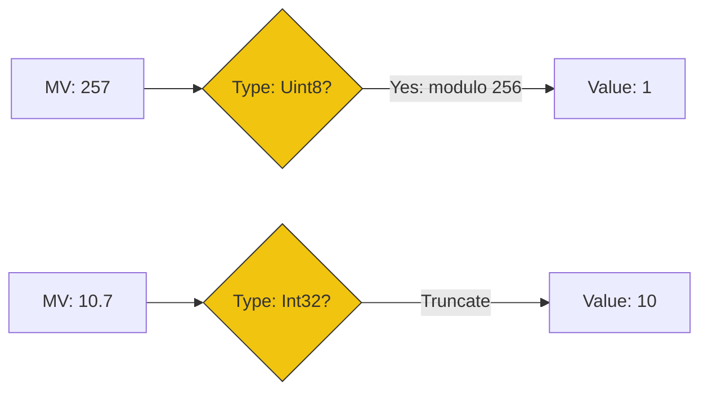

# CH-04: Mathematical Values and Clamping

> **"Jembatan Abstraksi ke Realita. `Mathematical Values and Clamping` membedah transformasi dari nilai matematika ideal menuju nilai bahasa yang terikat batas memori."**

**Source Hub**: 
- [ECMA-262: Mathematical Operations](https://tc39.es/ecma262/#sec-mathematical-operations)

---

## 1. Konsep & Esensi

**Definisi Arsitek**:
Di level terdalam Hub, spesifikasi bekerja menggunakan **Mathematical Values (MV)**—angka murni dengan presisi tak terbatas. Namun, saat nilai ini harus disimpan sebagai **Language Type** (seperti `Uint8` atau `Number`), Hub melakukan **Clamping** atau **Wrapping** (modul 2^n) untuk menyesuaikan nilai tersebut dengan arsitektur hardware.

**Model Mental**:
- **MV**: Air yang melimpah tak terbatas di bendungan logika.
- **Clamping**: Keran yang membatasi debit air agar muat ke dalam botol (kapasitas memori).

---

## 2. Visualisasi Sistem: The Wrapping Mechanism

---

## 3. Mekanisme & Hubungan

### Konversi Tipe Internal (Clause 6.1.6)
1. **Modulo Wrapping**: Saat memasukkan angka besar ke `TypedArray` (misal: `Uint8Array`), Hub tidak melempar error jika angka melampaui 255. Ia melakukan operasi sisa bagi (`value mod 256`), sehingga 256 menjadi 0, dan 257 menjadi 1.
2. **Integer Truncation**: Operasi `ToInt32(v)` atau `ToUint32(v)` membuang seluruh bagian desimal tanpa pembulatan (floor untuk positif, ceiling untuk negatif).
3. **Infinite Range in Spec**: Memahami MV adalah kunci membaca algoritma Hub. Jika spesifikasi mengatakan "add 1 to the mathematical value", itu berarti tidak ada overflow yang terjadi sampai langkah konversi ke Language Type dilakukan.

### Arsitek Mindset: Overflow Prediction
- Selalu antisipasi perilaku **Wrapping** saat bekerja dengan data biner atau sistem grafis. Kesalahan dalam memprediksi sisa bagi pada level `Uint8` atau `Int32` seringkali menjadi celah keamanan (Buffer Overflow) atau bug logika yang sulit dideteksi di sirkuit Hub.

---

## 4. Lab Praktis
Buka file `examples/clamping_logic_lab.js` untuk mengamati bagaimana `Uint8Array` menangani angka di luar batas 0-255 dan bagaimana Hub melakukan pemotongan desimal secara internal.

---
*Status: [status.md](../../../../../status.md)*
