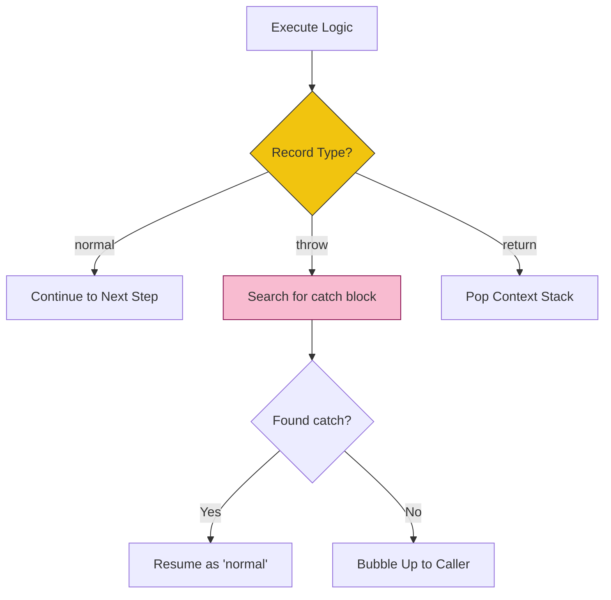

# CH-02: Completion Records and Flow Control

> **"Protokol Rambatan Status. `Completion Records and Flow Control` membedah mekanisme formal Hub dalam melacak keberhasilan, interupsi, dan kegagalan sirkuit logika."**

**Source Hub**: 
- [ECMA-262: Completion Record Specification Type](https://tc39.es/ecma262/#sec-completion-record-specification-type)

---

## 1. Konsep & Esensi

**Definisi Arsitek**:
Setiap instruksi di Hub mengembalikan sebuah **Completion Record**. Ia adalah Record dengan tiga field utama: `[[Type]]`, `[[Value]]`, dan `[[Target]]`. Mekanisme ini memastikan bahwa Hub selalu tahu apakah ia harus lanjut ke baris berikutnya (`normal`), keluar dari fungsi (`return`), atau meledakkan sirkuit (`throw`).

---

## 2. Visualisasi Sistem: Completion Propagation

---

## 3. Mekanisme & Hubungan

### Anatomi Kontrol Aliran (Clause 6.2.4)
1. **Normal vs Abrupt**: Segala sesuatu yang bukan `normal` disebut **Abrupt Completion**. Ini adalah interupsi aliran energi yang sah di dalam Hub.
2. **The `?` and `!` Shorthands**: 
   - `?`: "Jalankan, jika gagal langsung lempar ke atas (bubble up)."
   - `!`: "Jalankan, ini dijamin tidak akan pernah gagal (sirkuit aman)."
3. **Completion Unwrapping**: Sebagian besar algoritma hanya peduli pada `[[Value]]` dari sebuah Record bertipe `normal`. Nilai ini diekstraksi sebelum diproses lebih lanjut.

---

## 4. Lab Praktis
Buka file `examples/completion_flow_lab.js` untuk melihat simulasi bagaimana sinyal `throw` merambat melalui tumpukan pemanggilan fungsi sampai ia diubah kembali menjadi `normal` oleh blok `catch`.

---
*Status: [status.md](../../../../../status.md)*
