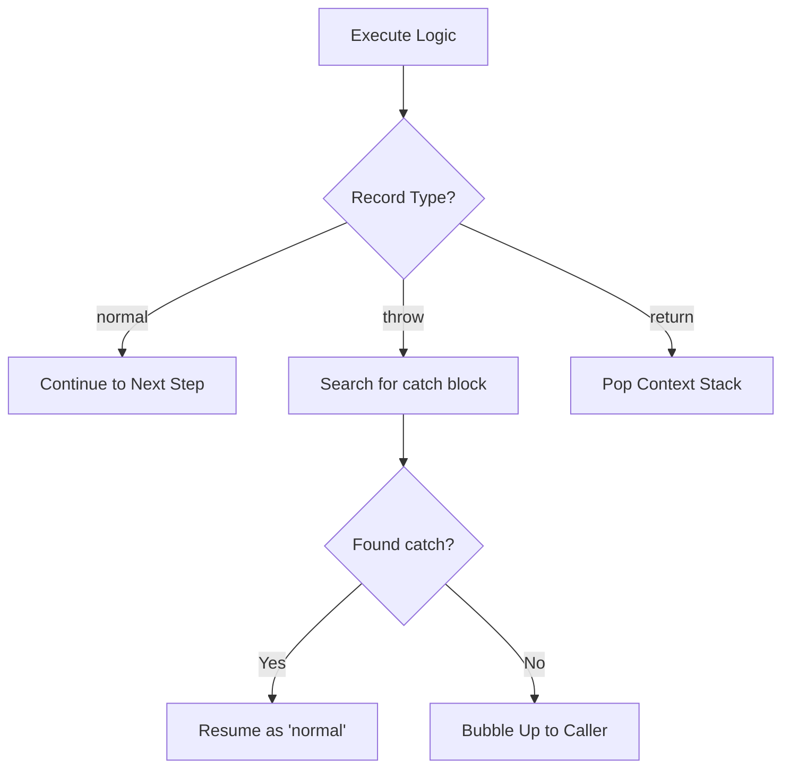

# CH-02: Completion Records and Flow Control

> **"Protokol Rambatan Status. `Completion Records and Flow Control` membedah mekanisme formal Hub dalam melacak keberhasilan, interupsi, dan kegagalan sirkuit logika."**

**Source Hub**: 
- [ECMA-262: Completion Record Specification Type](https://tc39.es/ecma262/#sec-completion-record-specification-type)

---

## 1. Konsep & Esensi

**Definisi Arsitek**:
Setiap instruksi di Hub mengembalikan sebuah **Completion Record**. Ia adalah Record dengan tiga field utama: `[[Type]]` (Enum), `[[Value]]` (Language Type), dan `[[Target]]`. Mekanisme ini memastikan Hub selalu tahu status eksekusi terakhir: apakah harus lanjut ke baris berikutnya (`normal`), keluar dari fungsi (`return`), atau memutus sirkuit akibat error (`throw`).

---

## 2. Visualisasi Sistem: Completion Propagation

---

## 3. Mekanisme & Hubungan

### Anatomi Kontrol Aliran (Clause 6.2.4)
1.  **Normal vs Abrupt**: Segala sesuatu yang bukan `normal` disebut **Abrupt Completion**. Ini adalah strategi Hub untuk menghentikan aliran energi secara sah tanpa merusak integritas sistem.
2.  **The `?` Shorthand (ReturnIfAbrupt)**: Dalam spesifikasi, tanda tanya `?` berarti: "Jalankan operasi ini. Jika hasilnya adalah abrupt completion, langsung kembalikan (bubble up) hasilnya ke pemanggil."
3.  **The `!` Shorthand**: Tanda seru `!` berarti: "Jalankan operasi ini. Saya (penulis spesifikasi) menjamin sirkuit ini 100% aman dan tidak akan pernah menghasilkan abrupt completion."

---

## 4. Arsitek Mindset
Setiap blok `try...catch` di kode Anda adalah instruksi kepada Hub untuk mengubah `throw completion` kembali menjadi `normal completion`. Pahami bahwa error bukanlah akhir, melainkan sinyal status yang harus Anda "tangkap" dan "normalisir" di sirkuit tingkat atas.

---

## 5. Lab Praktis
Eksperimen di folder `examples/` membedah dua pilar utama:
1.  **[Completion Propagation](./examples/01_completion_propagation.js)**: Simulasi bagaimana status `throw` merambat ke atas melalui tumpukan fungsi.
2.  **[Shorthand Logic](./examples/02_shorthand_logic.js)**: Demonstrasi logika di balik operator `?` dan `!` dalam penanganan error.

---
*Status: [status.md](../../../../../status.md)*
