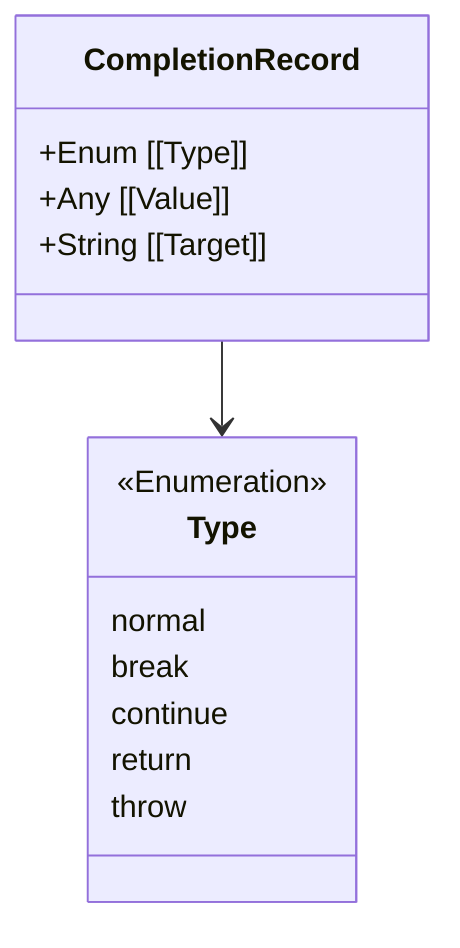

# CH-02: Control Flow Records

> **"Laporan status eksekusi sirkuit. `Control Flow Records` memastikan Hub tahu apakah sebuah instruksi berakhir dengan damai atau memicu ledakan error."**

**Source Hub**: 
- [ECMA-262: Completion Record](https://tc39.es/ecma262/#sec-completion-record-specification-type)

---

## 1. Konsep & Esensi

**Definisi Arsitek**:
**Completion Record** adalah tipe data spesifikasi yang paling penting. Ia adalah paket data yang dikembalikan oleh setiap langkah algoritma untuk melaporkan status eksekusi. Record ini memiliki tiga field utama: **[[Type]]**, **[[Value]]**, dan **[[Target]]**.

**Model Mental**:
Bayangkan sistem laporan otomatis di Hub. Setiap kali sebuah sirkuit selesai bekerja, ia mengirimkan sinyal: "Status: NORMAL, Output: 220V" atau "Status: ERROR, Pesan: Overload".

---

## 2. Visualisasi Sistem: The Result Packet

---

## 3. Mekanisme & Hubungan

### Aliran Kontrol
1. **Normal Completion**: Menandakan langkah selesai tanpa gangguan.
2. **Abrupt Completion**: Terjadi saat ada `throw`, `return`, `break`, atau `continue`. Ini memicu mekanisme "Bubbling Up" (melompat keluar dari blok kode) sampai ada sirkuit yang menangkapnya (misal: `try...catch`).
3. **Completion Operations**: Algoritma internal seperti `UpdateEmpty` atau `NormalCompletion()` yang digunakan untuk memanipulasi paket-paket laporan ini.

### Arsitek Mindset: Predictable Flow
- Dengan memahami Completion Records, Anda akan mengerti mengapa `return` di dalam loop `forEach` tidak bekerja seperti yang Anda harapkan; itu karena sirkuit internal `forEach` tidak didesain untuk merespons interupsi `return` record dari callback-nya.

---

## 4. Lab Praktis
Buka file `examples/completion_flow_lab.js` untuk melihat bagaimana simulasi Completion Record menangani skenario `throw` dan `return` di dalam tumpukan panggilan fungsi.

---
*Status: [status.md](../../../../../status.md)*
