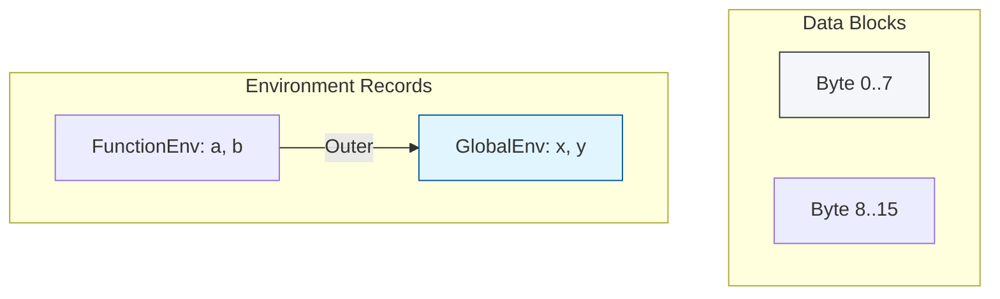

# CH-04: Advanced Spec Components

> **"Blok bangunan tingkat rendah untuk arsitektur Hub. `Advanced Spec Components` membedah pengelolaan memori mentah, pengelolaan scope, dan penanganan fungsi tanpa nama."**

**Source Hub**: 
- [ECMA-262: Data Blocks](https://tc39.es/ecma262/#sec-data-blocks)
- [ECMA-262: Environment Records](https://tc39.es/ecma262/#sec-lexical-environments)

---

## 1. Konsep & Esensi

**Definisi Arsitek**:
Tipe spesifikasi tingkat lanjut meliputi:
1. **Data Blocks**: Urutan byte memori mentah yang mendasari `ArrayBuffer` dan `SharedArrayBuffer`.
2. **Environment Records**: Struktur internal yang menyimpan pemetaan variabel di dalam sebuah scope (Lexical Environment).
3. **Abstract Closures**: Cara spesifikasi mendefinisikan "fungsi anonim" internal yang membawa status lingkungannya.

**Model Mental**:
- **Data Blocks**: Fondasi semen (memori mentah) tempat Grid dibangun.
- **Environment Records**: Buku alamat Hub yang mencatat lokasi setiap variabel.
- **Abstract Closures**: Robot mini yang membawa baterai sendiri saat berkeliling di Grid.

---

## 2. Visualisasi Sistem: Memory and Scope Infrastructure

---

## 3. Mekanisme & Hubungan

### Komponen Infrastruktur
1. **Data Blocks (Clause 6.2.8)**: Tidak bisa diakses langsung, tapi krusial untuk transfer data antar thread (Web Workers). Hub menjamin operasi pada blok data ini bersifat atomik jika menggunakan sirkuit yang benar.
2. **Environment Records**: Terdiri dari Object environment (untuk `with` atau Global) dan Declarative environment (untuk `let/const`).
3. **Class field/Static definitions**: Aturan spec yang menjelaskan bagaimana properti class diinisialisasi saat sebuah instance Hub dibuat.

### Arsitek Mindset: System Integrity
- Memahami Data Blocks memberikan Anda rasa hormat terhadap keamanan memori di JavaScript. Meskipun kita tidak mengelolanya secara manual (seperti di C++), mengetahui bahwa Hub mengisolasinya menjamin stabilitas aplikasi skala besar.

---

## 4. Lab Praktis
Buka file `examples/env_record_simulation.js` untuk melihat bagaimana simulasi Environment Record mencari nilai variabel dari scope lokal hingga global.

---
*Status: [status.md](../../../../../status.md)*
