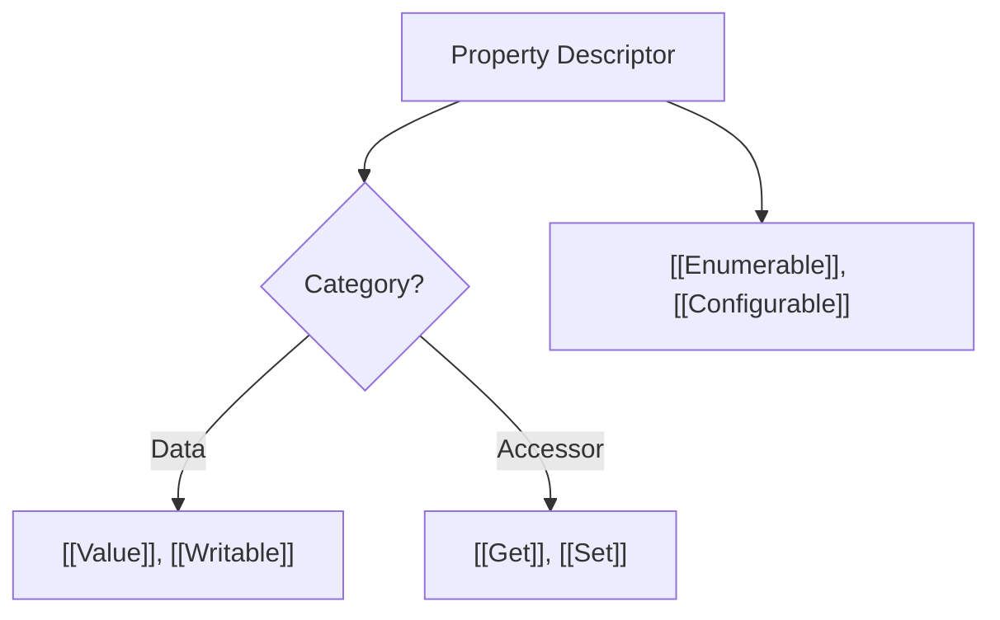

# CH-04: Property Descriptors and Data Blocks

> **"Arsitektur Kontrol Memori. `Property Descriptors and Data Blocks` membedah cara Hub mengatur izin akses properti dan mengelola blok memori mentah."**

**Source Hub**: 
- [ECMA-262: Property Descriptor Specification Type](https://tc39.es/ecma262/#sec-property-descriptor-specification-type)
- [ECMA-262: Data Blocks](https://tc39.es/ecma262/#sec-data-blocks)

---

## 1. Konsep & Esensi

**Definisi Arsitek**:
**Property Descriptors** adalah Record yang mendefinisikan "izin" bagi setiap properti objek. Ia adalah penjaga gerbang yang menentukan apakah sebuah nilai bisa diubah (`writable`) atau dihapus (`configurable`). Di level yang lebih rendah, Hub mengelola **Data Blocks**—urutan byte mentah yang digunakan untuk menyimpan data dalam sirkuit memori byte-access seperti `ArrayBuffer`.

---

## 2. Visualisasi Sistem: Descriptor Anatomy

---

## 3. Mekanisme & Hubungan

### Kendali Akses & Blok Memori (Clause 6.2.6 - 6.2.8)
1.  **Data vs Accessor**: Sebuah properti hanya bisa menjadi salah satu pola: ia menyimpan nilai mentah (*Data Descriptor*) atau bertindak sebagai portal fungsi (*Accessor Descriptor*). Mencampur keduanya akan menyebabkan kegagalan validasi sirkuit Hub.
2.  **Integrity Constraints**: Melalui API seperti `Object.freeze()`, arsitek secara langsung memodifikasi seluruh sirkuit deskriptor properti menjadi `configurable: false` dan `writable: false`, menciptakan objek yang tak tertembus modifikasi.
3.  **Data Blocks Isolation**: Data Block bersifat atomik dan statis. Begitu didefinisikan ukurannya, sirkuit memori ini dipisahkan dari sirkuit logika bahasa, memastikan keamanan akses memori tingkat rendah.

---

## 4. Arsitek Mindset
Pahami bahwa di balik setiap properti objek yang terlihat sederhana, terdapat sistem pertahanan deskriptor yang rumit. Gunakan *Accessor Descriptors* (Get/Set) saat Anda membutuhkan validasi data otomatis saat terjadi aliran state ke dalam objek.

---

## 5. Lab Praktis
Eksperimen di folder `examples/` membedah pilar utama:
1.  **[Descriptor Types](./examples/01_descriptor_types.js)**: Membandingkan perilaku deskriptor Data vs Accessor dan bagaimana Hub menolak percampuran keduanya.

---
*Status: [status.md](../../../../../status.md)*
