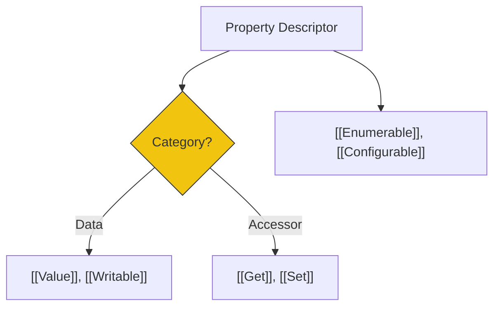

# CH-04: Property Descriptors and Data Blocks

> **"Arsitektur Kontrol Memori. `Property Descriptors and Data Blocks` membedah cara Hub mengatur izin akses properti dan mengelola blok memori mentah."**

**Source Hub**: 
- [ECMA-262: Property Descriptor Specification Type](https://tc39.es/ecma262/#sec-property-descriptor-specification-type)
- [ECMA-262: Data Blocks](https://tc39.es/ecma262/#sec-data-blocks)

---

## 1. Konsep & Esensi

**Definisi Arsitek**:
**Property Descriptors** adalah Record yang mendefinisikan "izin" bagi setiap properti (Data atau Accessor). Di level yang lebih rendah, Hub mengelola **Data Blocks**—urutan byte mentah yang digunakan untuk menyimpan data dalam `ArrayBuffer`. Ini adalah jembatan langsung antara Hub dan hardware memori.

**Model Mental**:
- **Descriptor**: Sertifikat hak milik sebuah laci (Siapa yang boleh baca/tulis/hapus).
- **Data Block**: Lembaran kertas mentah tempat tinta (bit) dituliskan secara fisik.

---

## 2. Visualisasi Sistem: Descriptor Anatomy

---

## 3. Mekanisme & Hubungan

### Kendali Akses (Clause 6.2.6 - 6.2.8)
1. **Integrity Levels**: `Object.preventExtensions`, `Object.seal`, dan `Object.freeze` bekerja dengan memodifikasi field `[[Configurable]]` dan `[[Writable]]` pada seluruh descriptor di dalam objek tersebut.
2. **Accessor Precedence**: Jika sebuah descriptor memiliki `[[Get]]`, ia TIDAK boleh memiliki `[[Value]]`. Perampasan data harus dilakukan secara dinamis melalui portal fungsi.
3. **Data Blocks Isolation**: Setiap Data Block memiliki ukuran tetap dan diinisialisasi dengan nol. Sekali dibuat, sirkuit memori ini dipisahkan dari sirkuit logika bahasa sampai ia dipetakan via `TypedArray`.

### Arsitek Mindset: Memory Safety
- Gunakan **Data Blocks** (via `SharedArrayBuffer`) untuk komunikasi antar-Agent (Worker) dengan kecepatan tinggi. Namun, selalau waspadai **Race Conditions** di level memori mentah yang tidak diatur oleh sirkuit otomatis Hub.

---

## 4. Lab Praktis
Buka file `examples/descriptor_lock_lab.js` untuk melihat bagaimana penguncian descriptor mencegah penghapusan properti penting meskipun nilainya masih bisa diubah.

---
*Status: [status.md](../../../../../status.md)*
