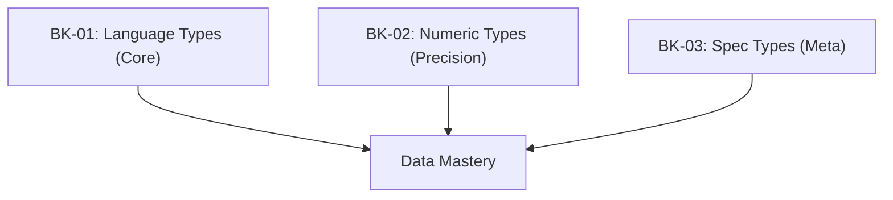

# SR-02: Data Types and Values (The Fuel)

> **"Bahan bakar yang menggerakkan seluruh sirkuit Grid. SR-02 membedah 'Tipe Data dan Nilai' (The Fuel)—spesifikasi teknis dari setiap unit informasi yang diproses di dalam Hub."**

**Source Hub**: 
- [ECMA-262: Data Types and Values](https://tc39.es/ecma262/#sec-ecmascript-data-types-and-values)
- [MDN: JavaScript Data Types](https://developer.mozilla.org/en-US/docs/Web/JavaScript/Data_structures)

---

## 🏗️ The 3 Pillars of Data Architecture

---

## Koleksi Buku:
1.  **[BK-01: Language Core Types](./BK-01_LanguageCoreTypes/)**: Primitif dasat (Undefined, Null, Boolean, String, Symbol) dan Objektor.
2.  **[BK-02: Numeric Data Types](./BK-02_NumericDataTypes/)**: Detil teknis Number (IEEE 754) dan BigInt.
3.  **[BK-03: Specification Data Types](./BK-03_SpecificationDataTypes/)**: Tipe meta internal spek (List, Record, Completion, Reference).

---
*Status: [status.md](../../status.md) | Back to [RAK-04](../README.md)*
