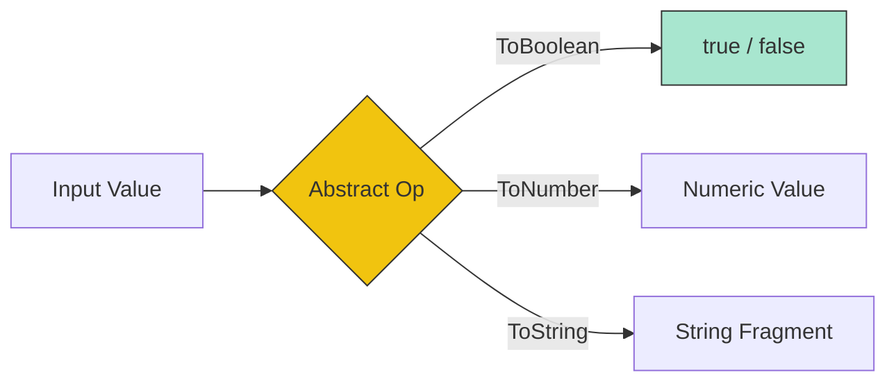

# CH-01: Primitive Conversions

> **"Penyelarasan tegangan energi. `Primitive Conversions` adalah seperangkat aturan yang memastikan data mentah bisa saling berkomunikasi di dalam sirkuit Hub."**

**Source Hub**: 
- [ECMA-262: ToBoolean](https://tc39.es/ecma262/#sec-toboolean)
- [ECMA-262: ToNumber](https://tc39.es/ecma262/#sec-tonumber)
- [ECMA-262: ToString](https://tc39.es/tostring)

---

## 1. Konsep & Esensi

**Definisi Arsitek**:
Dalam Hub, seringkali sebuah sirkuit mengharapkan Tipe X tapi menerima Tipe Y. **Primitive Conversions** (ToBoolean, ToNumber, ToString) adalah algoritma internal (Abstract Ops) yang secara otomatis melakukan penyesuaian tipe agar operasi bisa berlanjut.

**Model Mental**:
Bayangkan adaptor colokan listrik universal. Meskipun kabelnya berbeda bentuk, adaptor (Abstract Op) akan mengubahnya agar pas dengan stopkontak Hub yang dituju.

---

## 2. Visualisasi Sistem: Conversion Matrix

---

## 3. Mekanisme & Hubungan

### Tiga Pilar Konversi
1. **ToBoolean (Clause 7.1.2)**: Mekanisme tersederhana. Hanya ada daftar nilai "Falsy" (`undefined`, `null`, `false`, `+0`, `-0`, `NaN`, `""`). Sisanya selalu menjadi `true`.
2. **ToNumber (Clause 7.1.3)**: Mengubah teks atau objek menjadi angka. Jika inputnya adalah string yang bukan angka valid, ia akan menghasilkan `NaN`.
3. **ToString (Clause 7.1.12)**: Mengubah nilai apapun menjadi representasi teks. Sangat krusial saat melakukan penggabungan string (`+`).

### Arsitek Mindset: Implicit Coercion
- Sadari bahwa Hub sangat "pemaaf" (Loose Typing). Namun, toleransi ini bisa menyebabkan bug tak kasat mata jika Anda tidak memahami bagaimana `ToNumber` memperlakukan array kosong (menjadi `0`) vs objek kosong (menjadi `NaN`).

---

## 4. Lab Praktis
Buka file `examples/primitive_conversion_lab.js` untuk menguji hasil konversi ekstrim pada berbagai tipe data menggunakan operator `+` dan `!`.

---
*Status: [status.md](../../../../../status.md)*
