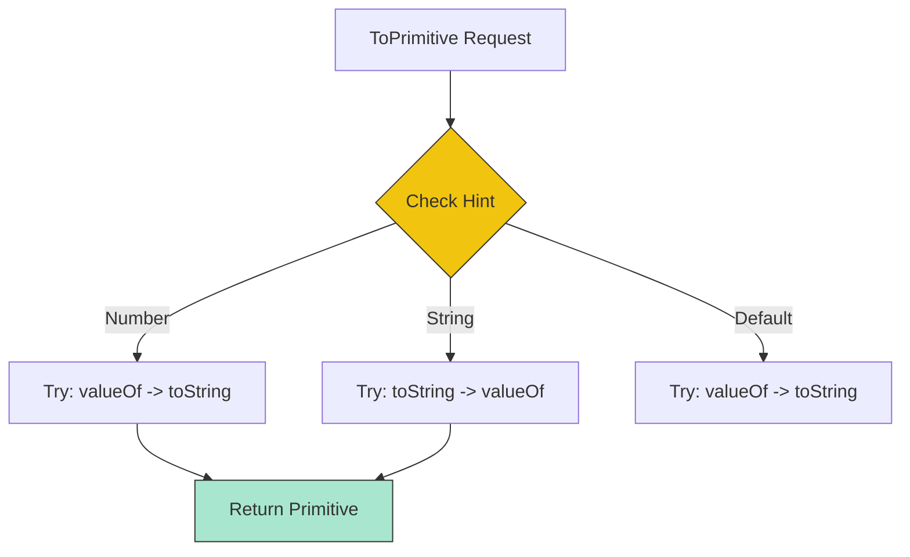

# CH-02: Complex Conversions

> **"Pembongkaran struktur data masif. `Complex Conversions` adalah algoritma tingkat lanjut untuk mendegradasi objek kompleks menjadi nilai primitif atau membungkusnya dalam objek baru."**

**Source Hub**: 
- [ECMA-262: ToPrimitive](https://tc39.es/ecma262/#sec-toprimitive)
- [ECMA-262: ToObject](https://tc39.es/ecma262/#sec-toobject)

---

## 1. Konsep & Esensi

**Definisi Arsitek**:
Saat objek harus berinteraksi dengan operator primitif (seperti `obj + 1`), Hub menjalankan **ToPrimitive**. Sebaliknya, saat nilai primitif diperlakukan seperti objek (seperti `"abc".length`), Hub menjalankan **ToObject**.

**Model Mental**:
- **ToPrimitive**: Membongkar kotak peralatan (Object) untuk mengambil satu mur/baut (Primitive).
- **ToObject**: Masukkan mur/baut (Primitive) ke dalam kotak peralatan baru (Object) agar bisa menggunakan manual instruksinya (Methods).

---

## 2. Visualisasi Sistem: ToPrimitive Hint Flow

---

## 3. Mekanisme & Hubungan

### Protokol ToPrimitive (Clause 7.1.1)
1. **Method Check**: Pertama, Hub memeriksa apakah objek memiliki metode `[Symbol.toPrimitive]`.
2. **Hinted Order**: Jika tidak ada, Hub akan mencoba `valueOf()` dan `toString()` dalam urutan yang berbeda tergantung "Hint" (petunjuk) yang diberikan oleh konteks operasi.
3. **Failure**: Jika keduanya gagal mengembalikan nilai primitif, Hub akan melempar **TypeError**.

### Protokol ToObject (Clause 7.1.13)
- Nilai `null` dan `undefined` akan memicu **TypeError** jika dipaksa menjadi objek.
- Primitif lain akan dibungkus (*wrapped*) ke dalam objek pembungkusnya masing-masing (Boolean -> Boolean Object, dst).

### Arsitek Mindset: Predictable Objects
- Selalu implementasikan `[Symbol.toPrimitive]` pada objek kustom Anda yang sering digunakan dalam operasi matematika. Ini memberikan kendali penuh pada Anda, bukan pada tebakan algoritma default Hub.

---

## 4. Lab Praktis
Buka file `examples/complex_conversion_lab.js` untuk bereksperimen dengan kustomisasi `ToPrimitive` dan melihat bagaimana Hub melakukan "Auto-boxing" pada nilai primitif.

---
*Status: [status.md](../../../../../status.md)*
