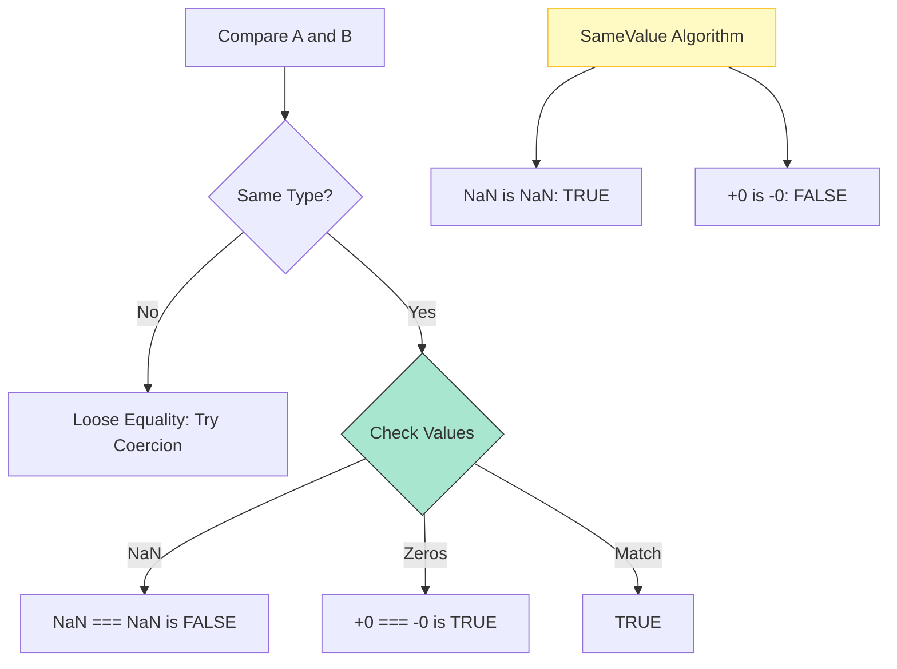

# CH-01: Equality and Comparison Algorithms

> **"Menimbang bobot energi yang sama. `Equality Algorithms` adalah sekumpulan aturan yang menentukan apakah dua unit data dianggap identik di dalam Grid."**

**Source Hub**: 
- [ECMA-262: IsStrictlyEqual](https://tc39.es/ecma262/#sec-isstrictlyequal)
- [ECMA-262: SameValue](https://tc39.es/ecma262/#sec-samevalue)
- [ECMA-262: SameValueZero](https://tc39.es/ecma262/#sec-samevaluezero)

---

## 1. Konsep & Esensi

**Definisi Arsitek**:
JavaScript memiliki empat algoritma perbandingan utama: **Strict Equality** (`===`), **Loose Equality** (`==`), **SameValue** (untuk `Object.is`), dan **SameValueZero** (digunakan internal oleh Map/Set). Masing-masing memiliki toleransi yang berbeda terhadap nilai khusus seperti `NaN` dan `+/-0`.

**Model Mental**:
Bayangkan timbangan di Hub.
- **Strict**: Menimbang berat dan memeriksa label tipe.
- **Loose**: Mencoba mengubah tipe agar sama sebelum menimbang.
- **SameValue**: Timbangan super presisi yang bisa membedakan nol positif dan nol negatif.

---

## 2. Visualisasi Sistem: Equality Comparison Flow

---

## 3. Mekanisme & Hubungan

### Empat Pilar Identitas
1. **IsStrictlyEqual (Clause 7.2.13)**: Digunakan oleh `===`. Perlakuan khusus: `NaN` tidak sama dengan dirinya sendiri, dan `+0` sama dengan `-0`.
2. **IsLooselyEqual (Clause 7.2.12)**: Digunakan oleh `==`. Melakukan konversi tipe otomatis sebelum membandingkan. **Hindari ini** demi stabilitas arsitektur.
3. **SameValue (Clause 7.2.10)**: Digunakan oleh `Object.is`. Satu-satunya algoritma yang menganggap `NaN` identik dengan `NaN` dan `+0` berbeda dari `-0`.
4. **SameValueZero (Clause 7.2.11)**: Mirip `SameValue`, tapi menganggap `+0` sama dengan `-0`. Digunakan untuk mengecek kunci di dalam `Map` dan `Set`.

### Arsitek Mindset: Identity Precision
- Selalu gunakan `===` sebagai standar default. Gunakan `Object.is` (SameValue) hanya jika Anda berurusan dengan logika matematika yang sensitif terhadap arah nol atau deteksi `NaN` yang presisi.

---

## 4. Lab Praktis
Buka file `examples/equality_algorithms_lab.js` untuk melihat tabel kebenaran dari keempat algoritma perbandingan ini pada nilai-nilai ekstrem di Hub.

---
*Status: [status.md](../../../../../status.md)*
