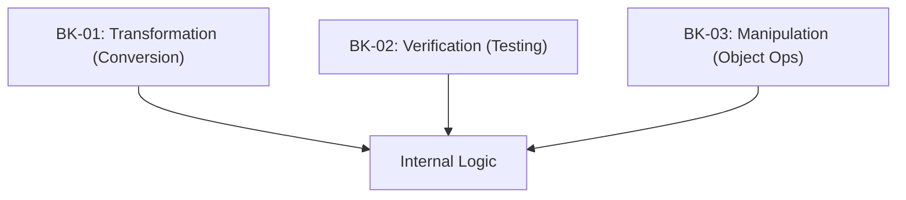

# SR-03: Abstract Operations (The Engine Logic)

> **"Logika internal yang menggerakkan seluruh sirkuit Hub. SR-03 membedah 'Operasi Abstrak' (The Engine Logic)—algoritma tingkat rendah yang melakukan konversi, perbandingan, dan manipulasi objek."**

**Source Hub**: 
- [ECMA-262: Abstract Operations](https://tc39.es/ecma262/#sec-abstract-operations)

---

## 🏗️ The 3 Pillars of Engine Logic

---

## Koleksi Buku:
1.  **[BK-01: Type Conversion](./BK-01_TypeConversion/)**: Algoritma `ToNumber`, `ToString`, dan `ToPrimitive`.
2.  **[BK-02: Testing and Comparison](./BK-02_TestingAndComparison/)**: Algoritma `SameValue` dan `Strict Equality`.
3.  **[BK-03: Object Operations](./BK-03_ObjectOperations/)**: Operasi fundamental `Get`, `Set`, dan `HasProperty`.

---
*Status: [status.md](../../status.md) | Back to [RAK-04](../README.md)*
