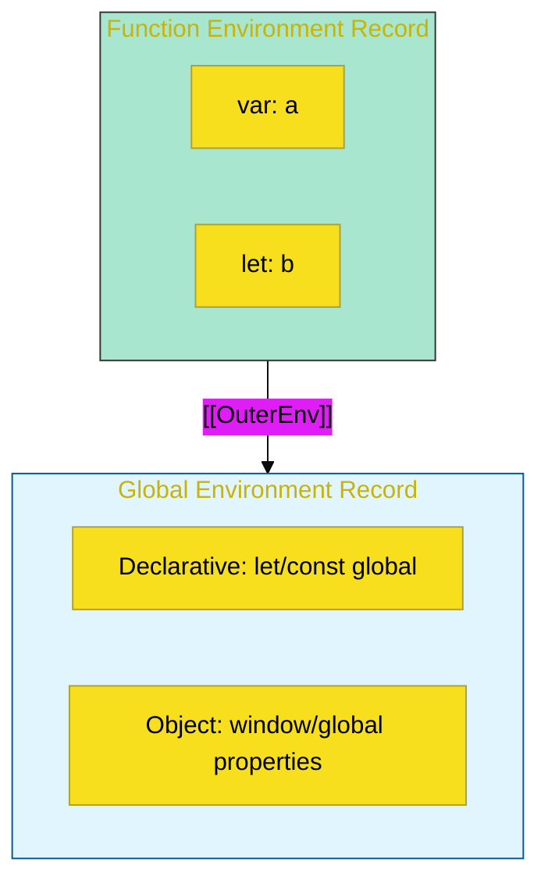

# CH-01: Environment Hierarchy & Record Types


> **"Sistem Navigasi Variabel: Struktur Memori yang Menentukan Lokasi Penyimpanan dan Resolusi Data di Setiap Lapis Scope."**

---

## 🌐 Source Hub
- **Parent Book**: [BK-02: Environment Records](../README.md)
- **Primary Source**: [ECMA-262: Environment Record Hierarchy (Clause 9.1.1)](https://tc39.es/ecma262/#sec-the-environment-record-hierarchy)

---

## 🌓 1. Essence: The Narrative

### The Scope Storage (Gudang Penyimpanan)
Data di dalam engine tidak melayang tanpa alasan. **Environment Record** adalah objek internal yang menyimpan pemetaan antara nama variabel (**Binding**) dan nilainya. Setiap record memiliki referensi ke **[[OuterEnv]]** (lingkungan luar), menciptakan sebuah hirarki pohon yang kita kenal sebagai **Scope Chain**.

### Dual Storage Strategy
Spesifikasi membagi gudang penyimpanan menjadi dua jenis utama:
1.  **Declarative Environment Record**: Gudang modern yang sangat cepat. Digunakan untuk menyimpan `let`, `const`, `class`, dan `function`. Data di sini bersifat privat dan dioptimalkan untuk performa tinggi.
2.  **Object Environment Record**: Gudang gaya lama yang menggunakan **Object** JavaScript nyata (seperti `window` di browser) sebagai tempat penyimpanan. Digunakan untuk global scope (sloppy) dan blok `with`.

---

## 🗺️ 2. Visual Logic: The Hierarchy Structure

Bagaimana record terhubung satu sama lain:



---

## ⚙️ 3. Spec-Internals: Record Varieties

| Jenis Record | Deskripsi Teknis | Karakteristik |
| :--- | :--- | :--- |
| **Declarative** | Menyimpan binding variabel secara langsung. | Privat, Cepat, Tanpa objek fisik. |
| **Object** | Mengikat variabel ke properti dari suatu `binding object`. | Transparan (window.x), Dinamis, Lebih lambat. |
| **Function** | Turunan Declarative khusus untuk fungsi. | Mengelola `this`, `super`, dan `new.target`. |
| **Module** | Menyimpan binding impor/ekspor modul. | Asinkron, Strict Mode otomatis. |

---

## 🧪 4. The Lab: Discovery Specimens

Eksperimen Penyimpanan Variabel:
```javascript
var globalVar = 100; // Masuk ke Object Record (Global)
console.log(window.globalVar); // 100 (Bisa diakses via window)

let localVar = 50;   // Masuk ke Declarative Record (Global)
console.log(window.localVar); // undefined (Tersembunyi di gudang privat)
```

1.  **[examples/environment_lookup_lab.js](../../../../../examples/environment_lookup_lab.js)**: Demonstrasi resolusi [[OuterEnv]].
2.  **[examples/global_record_split.js](../../../../../examples/global_record_split.js)**: Pembuktian pemisahan Object vs Declarative di scope global.

---

## 🧠 5. Arsitek Mindset: Lexical Scoping
JavaScript menggunakan **Lexical Scoping**. Artinya, `[[OuterEnv]]` sebuah fungsi ditentukan saat fungsi tersebut DIDEFINISIKAN, bukan saat dijalankan. Inilah dasar mengapa **Closure** bisa bekerja dengan konsisten: fungsi membawa referensi ke "Gudang Penyimpanan" asalnya ke mana pun ia dikirim.

---
*Status: 🟢 Gold Standard | Kembali ke [BK-02](../README.md)*
