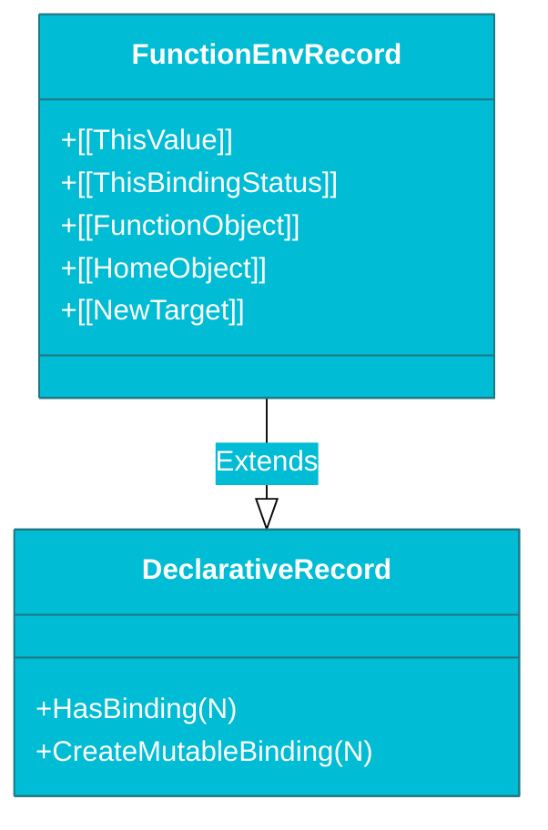

# CH-02: Function Environments (The Command Centers)

> **"Pusat Komando Eksekusi: Sub-ruang yang Mengatur Konteks 'this', Akses 'super', dan Binding Parameter Fungsi."**

---

## 🌐 Source Hub
- **Parent Book**: [BK-02: Environment Records](../README.md)
- **Primary Source**: [ECMA-262: Function Environment Records (Clause 9.1.1.2)](https://tc39.es/ecma262/#sec-function-environment-records)

---

## 🌓 1. Essence: The Narrative

### The Local Command Center
Setiap kali fungsi dipanggil, engine menciptakan **Function Environment Record**. Ini adalah varian dari *Declarative Record* yang memiliki tugas tambahan untuk mengelola parameter fungsi (`arguments`), serta menentukan nilai **`this`** dan tautan **`super`**.

### Specialty Bindings
Berbeda dengan record biasa, Function Record melacak:
- **[[ThisValue]]**: Lokasi memori yang dirujuk oleh kata kunci `this`.
- **[[ThisBindingStatus]]**: Status pengikatan (lexical, initialized, uninitialized).
- **[[FunctionObject]]**: Referensi balik ke fungsi yang sedang dieksekusi.
- **[[HomeObject]]**: Digunakan untuk resolusi `super` pada metode objek atau kelas.

---

## 🗺️ 2. Visual Logic: The Function Record Layout

---

## ⚙️ 3. Spec-Internals: Binding Methods

Function Record menambahkan metode khusus untuk manajemen konteks:

| Metode | Deskripsi |
| :--- | :--- |
| **BindThisValue(V)** | Menetapkan nilai `this` untuk pemanggilan fungsi. |
| **GetThisBinding()** | Mengambil nilai `this` saat ini (Melempar error jika uninitialized). |
| **HasThisBinding()** | Mengecek apakah record mendukung pengikatan `this`. |
| **HasSuperBinding()** | Mengecek apakah record mendukung pemanggilan `super`. |

---

## 🧪 4. The Lab: Discovery Specimens

Eksperimen Konteks Fungsi:
1.  **[examples/function_context_verify.js](../../../../../examples/function_context_verify.js)**: Verifikasi perilaku `this` pada arrow function vs regular function.
2.  **[examples/super_binding_lab.js](../../../../../examples/super_binding_lab.js)**: Pembuktian mekanisme `super` melalui `[[HomeObject]]`.

---

## 🧠 5. Arsitek Mindset: Arrow Functions vs Regular
Memahami **Function Environment Record** menjelaskan mengapa Arrow Functions tidak memiliki `this` sendiri. Secara teknis, Arrow Functions memiliki `[[ThisBindingStatus]]` bernilai `"lexical"`. Ini berarti mereka tidak mengimplementasikan `BindThisValue` dan akan selalu menelusuri `[[OuterEnv]]` untuk menemukan `this` dari "Command Center" di atasnya.

---
*Status: 🟢 Gold Standard | Kembali ke [BK-02](../README.md)*
