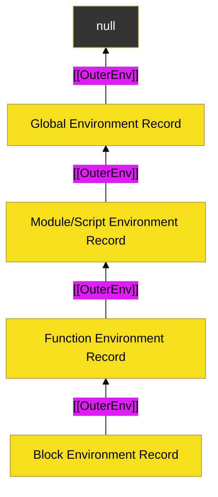

# CH-03: The Outer Link Mechanic (Scope Chains)

> **"Jembatan Antar-Dimensi: Mekanisme Tautan Luar yang Memungkinkan Engine Menelusuri Hirarki Scope Hingga ke Akar Global."**

---

## 🌐 Source Hub
- **Parent Book**: [BK-02: Environment Records](../README.md)
- **Primary Source**: [ECMA-262: Environment Record Hierarchy (Clause 9.1.1)](https://tc39.es/ecma262/#sec-the-environment-record-hierarchy)

---

## 🌓 1. Essence: The Narrative

### The Recursive Link
Setiap **Environment Record** memiliki satu slot internal krusial: **`[[OuterEnv]]`**. Slot ini menyimpan referensi ke Environment Record yang membungkusnya secara leksikal. Inilah yang secara teknis membangun sirkuit yang kita kenal sebagai **Scope Chain**.

### The End of the Line
Penelusuran variabel adalah proses rekursif. Engine memeriksa Record saat ini; jika tidak ditemukan, ia mengikuti kabel `[[OuterEnv]]` ke Record berikutnya. Proses ini berhenti hanya jika:
1.  Variabel ditemukan.
2.  `[[OuterEnv]]` bernilai **`null`** (menandakan kita telah mencapai **Global Environment** terjauh).

---

## 🗺️ 2. Visual Logic: The Chain Resolution Flow

---

## ⚙️ 3. Spec-Internals: Recursive Lookup Algorithm

Algoritma internal untuk resolusi variabel (Simplified):
1.  Let *lex* be the current Execution Context's LexicalEnvironment.
2.  Repeat:
    a. Let *exists* be *lex*.**HasBinding**(*name*).
    b. If *exists* is **true**, return the binding from *lex*.
    c. Let *outer* be *lex*.**[[OuterEnv]]**.
    d. If *outer* is **null**, throw **ReferenceError**.
    e. Set *lex* to *outer*.

---

## 🧪 4. The Lab: Discovery Specimens

Eksperimen Rantai Scope:
1.  **[examples/scope_chain_traversal.js](../../../../../examples/scope_chain_traversal.js)**: Visualisasi langkah demi langkah pencarian variabel di level engine.
2.  **[examples/shadowing_mechanics.js](../../../../../examples/shadowing_mechanics.js)**: Bagaimana binding lokal "memutus" jalur pencarian ke atas.

---

## 🧠 5. Arsitek Mindset: Static Scoping
Karena **`[[OuterEnv]]`** ditetapkan saat fungsi/blok dibuat (bukan saat dijalankan), JavaScript bersifat **Statically Scoped**. Sebagai arsitek, ini berarti Anda dapat memprediksi variabel mana yang akan diakses hanya dengan melihat struktur kode di editor, tanpa harus menjalankan program. Pemahaman ini sangat vital untuk mengelola performaLookup: semakin "jauh" variabel berada di rantai `[[OuterEnv]]`, semakin banyak langkah memori yang harus dilakukan engine.

---
*Status: 🟢 Gold Standard | Kembali ke [BK-02](../README.md)*
