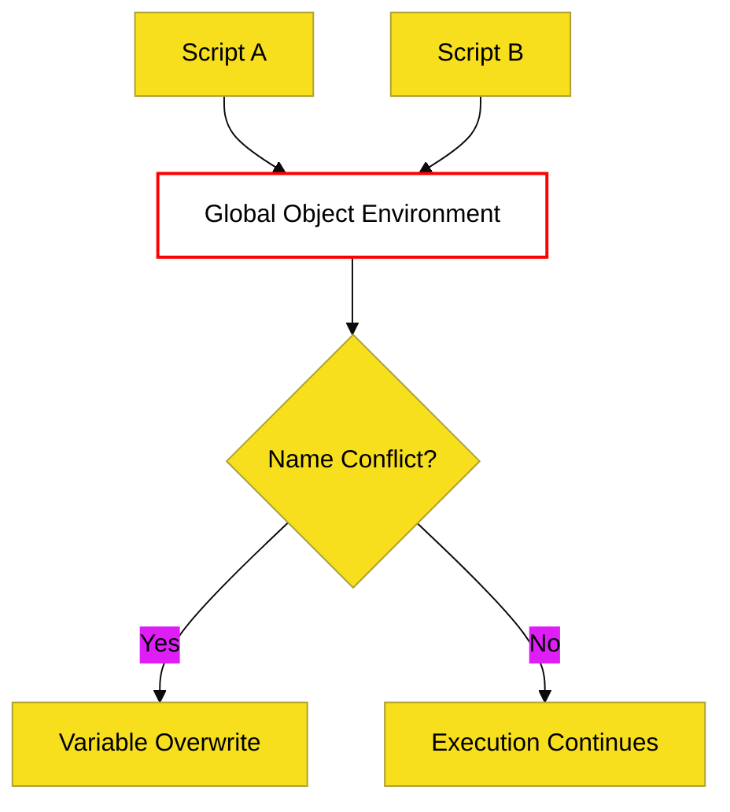

# CH-02: Open Circuits (The Sloppy Way)

> **"Sirkuit Terbuka: Membedah Jalur Eksekusi Script Tradisional yang Mengalir Langsung ke Global Stage Tanpa Isolasi."**

---

## 🌐 Source Hub
- **Parent Book**: [BK-04: Scripts and Evaluation](../README.md)
- **Primary Source**: [ECMA-262: Scripts (Clause 15.1)](https://tc39.es/ecma262/#sec-scripts)

---

## 🌓 1. Essence: The Narrative

### The Shared Grid
Dalam mode script klasik, kode beroperasi tanpa isolasi tingkat file. Semua unit kode berbagi **Global Environment** yang sama. Ini berarti variabel yang dideklarasikan dengan `var` di tingkat atas akan otomatis menjadi properti dari objek global (seperti `window` di browser).

### Architectural Risks
- **Name Collision**: Dua file berbeda bisa secara tidak sengaja menimpa variabel satu sama lain.
- **Pollution**: Objek global menjadi penuh dengan properti yang tidak terduga, meningkatkan kompleksitas debug.
- **Sloppy Mode**: Script sering kali berjalan dalam mode non-strict secara default, memungkinkan perilaku yang riskan seperti pembuatan variabel global implisit.

---

## 🗺️ 2. Visual Logic: Global Script Flow

---

## ⚙️ 3. Spec-Internals: Script Global Instantiation

Saat script dievaluasi, engine melakukan langkah-langkah berikut:
1.  **GlobalDeclarationInstantiation**: Mendaftarkan semua fungsi dan variabel `var` ke *Object Record* global.
2.  **Lexical Initialization**: Mendaftarkan `let`, `const`, dan `class` ke *Declarative Record* global.
3.  **Serial Evaluation**: Script dieksekusi baris demi baris.

---

## 🧪 4. The Lab: Discovery Specimens

Eksperimen Script Klasik:
1.  **[examples/global_pollution_lab.js](../../../../../examples/global_pollution_lab.js)**: Demonstrasi bagaimana `var` bocor ke `window` di browser.
2.  **[examples/sloppy_vs_strict_script.js](../../../../../examples/sloppy_vs_strict_script.js)**: Perbandingan perilaku error pada script biasa vs modul.

---

## 🧠 5. Arsitek Mindset: Batasi Sirkuit Terbuka
Sebagai arsitek, script klasik sebaiknya dianggap sebagai **Legacy Layer**. Gunakan hanya untuk pemuatan library lama atau konfigurasi global minimal. Untuk logika aplikasi inti, selalu gunakan **ES Modules (BK-05)** yang menawarkan isolasi scope otomatis dan keamanan *strict mode* secara default.

---
*Status: 🟢 Gold Standard | Kembali ke [BK-04](../README.md)*
