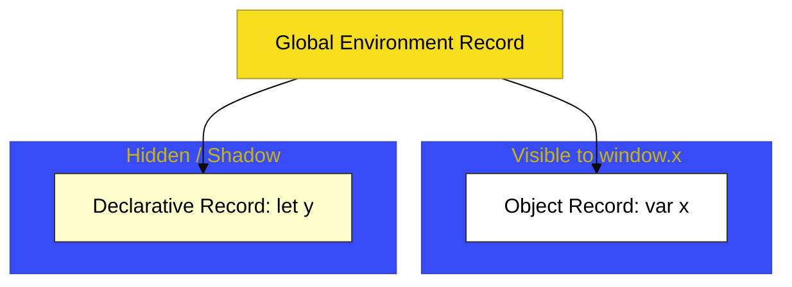

# CH-03: Scope Boundaries (Script Isolation)

> **"Dinding Pemisah: Bagaimana Engine Memisahkan Deklarasi Modern dari Polusi Global Menggunakan Lapis Declarative."**

---

## 🌐 Source Hub
- **Parent Book**: [BK-04: Scripts and Evaluation](../README.md)
- **Primary Source**: [ECMA-262: Global Environment Record (Clause 9.1.1.4)](https://tc39.es/ecma262/#sec-global-environment-records)

---

## 🌓 1. Essence: The Narrative

### The Shadow Layer
Meskipun script klasik bersifat terbuka, ECMAScript modern memperkenalkan mekanisme isolasi untuk `let`, `const`, dan `class` yang dideklarasikan di scope global. Variabel-variabel ini tidak masuk ke *Object Record* (tidak bisa diakses via `window`), melainkan tersimpan di **Global Declarative Record**.

### Access Rules
- **Shadowing**: Jika ada nama yang sama di *Object Record* (seperti properti bawaan `window`), versi di *Declarative Record* akan "menutupi" atau memenangkan resolusi nama.
- **Duality**: Global Environment Record secara teknis adalah komposit dari dua record terpisah. Ini menciptakan perilaku unik di mana variabel global ada di memori, tetapi "tembus pandang" bagi inspeksi objek global.

---

## 🗺️ 2. Visual Logic: The Global Dual-Anatomy

---

## ⚙️ 3. Spec-Internals: The Search Order

Saat engine mencari variabel global `name`:
1.  Periksa **Declarative Record**. Jika ada, return nilainya.
2.  Periksa **Object Record** (termasuk properti objek dasar seperti `Object`, `Array`).
3.  Jika tidak ada di keduanya, throw **ReferenceError**.

---

## 🧪 4. The Lab: Discovery Specimens

Eksperimen Isolasi Global:
1.  **[examples/global_scope_duality.js](../../../../../examples/global_scope_duality.js)**: Membuktikan bahwa `const x` tidak sama dengan `window.x`.
2.  **[examples/shadowing_builtins.js](../../../../../examples/shadowing_builtins.js)**: Bagaimana mendeklarasikan `let Object = 1` merusak akses ke global Object constructor.

---

## 🧠 5. Arsitek Mindset: Gunakan Shadowing dengan Bijak
Sebagai arsitek, pahami bahwa mendeklarasikan variabel modern di scope global tetap memiliki risiko. Meskipun terisolasi dari polusi objek global, mereka tetap bersifat "global" dalam sirkuit pencarian engine. Selalu prioritaskan penggunaan **Modules** untuk menjaga agar *Declarative Record* tetap lokal dan tidak membebani rantai resolusi global.

---
*Status: 🟢 Gold Standard | Kembali ke [BK-04](../README.md)*
