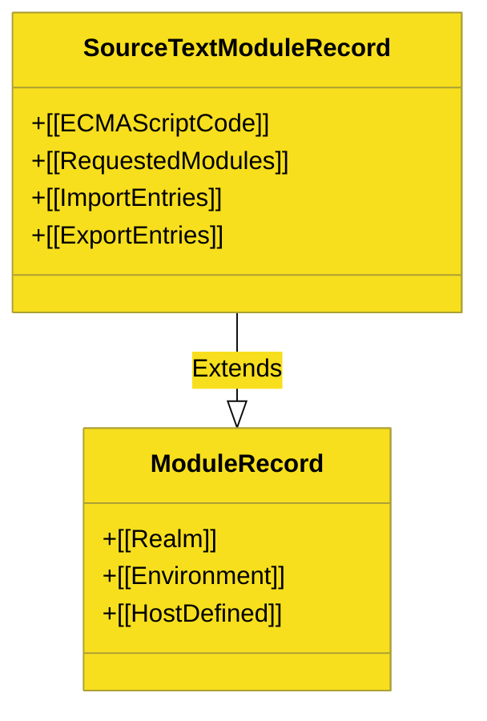

# CH-02: Module Records (The Structural Blueprints)

> **"Cetak Biru Modul: Bagaimana Engine Merepresentasikan Unit Kode Terisolasi Melalui Struktur Data Abstract Module Record."**

---

## 🌐 Source Hub
- **Parent Book**: [BK-05: Modules and Binding](../README.md)
- **Primary Source**: [ECMA-262: Abstract Module Records (Clause 15.2.1.1)](https://tc39.es/ecma262/#sec-abstract-module-records)

---

## 🌓 1. Essence: The Narrative

### The Record Identity
Sebelum kode modul dijalankan, engine menyusunnya ke dalam **Module Record**. Ini adalah objek internal yang menyimpan metadata tentang apa yang dibutuhkan modul tersebut (impor) dan apa yang ia bagikan (ekspor). Berbeda dengan script biasa, Module Record memiliki fase siklus hidup yang sangat ketat.

### Source Text Module
Jenis yang paling umum adalah **SourceText Module Record**. Ia menyimpan representasi AST (Abstract Syntax Tree) dari file `.js` atau `.mjs` Anda dan mengatur hubungan antara binding lokal dengan slot memori yang akan dibagikan ke modul lain.

---

## 🗺️ 2. Visual Logic: The Module Record Fields

---

## ⚙️ 3. Spec-Internals: Abstract Operations

Engine menggunakan operasi abstrak berikut untuk mengoperasikan Module Records:
1.  **Link()**: Menghubungkan semua impor ke ekspor yang sesuai di modul lain.
2.  **Evaluate()**: Mengeksekusi kode top-level modul.
3.  **GetExportedNames()**: Mencatat semua nama yang diekspor untuk resolusi eksternal.

---

## 🧪 4. The Lab: Discovery Specimens

Eksperimen Metadata Modul:
1.  **[examples/module_metadata_lab.mjs](../../../../../examples/module_metadata_lab.mjs)**: Investigasi properti `import.meta` dan status record.
2.  **[examples/namespace_object_inspect.mjs](../../../../../examples/namespace_object_inspect.mjs)**: Bedah objek `* as ns` untuk melihat representasi record di level bahasa.

---

## 🧠 5. Arsitek Mindset: Struktur Mendahului Eksekusi
Sebagai arsitek, pahami bahwa **Module Records bersifat statis**. Engine memetakan semua impor dan ekspor SEBELUM sebaris pun kode dijalankan. Inilah alasan mengapa `import` harus berada di tingkat atas dan tidak bisa di dalam blok `if`. Keamanan dan efisiensi ESM berasal dari kepastian struktural yang diberikan oleh Module Record ini.

---
*Status: 🟢 Gold Standard | Kembali ke [BK-05](../README.md)*
