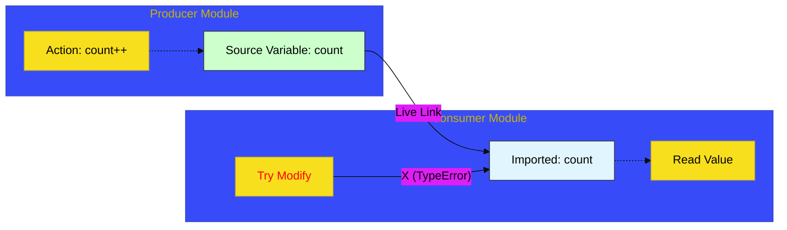

# CH-03: Reinforced Cables (Live Bindings)

> **"Kabel Diperkuat: Mekanisme Live Bindings yang Menjamin Sinkronisasi Data Real-Time Antar Modul Terkoneksi."**

---

## 🌐 Source Hub
- **Parent Book**: [BK-05: Modules and Binding](../README.md)
- **Primary Source**: [ECMA-262: Module Namespace Objects (Clause 10.4.6)](https://tc39.es/ecma262/#sec-module-namespace-exotic-objects)

---

## 🌓 1. Essence: The Narrative

### The Dynamic Link
Salah satu fitur paling kuat dari ES Modules (ESM) adalah **Live Bindings**. Berbeda dengan CommonJS yang menyalin nilai (copy), ESM membuat jalur langsung (link) ke lokasi memori variabel di modul asal. Jika nilai di modul asal berubah, semua modul yang mengimpornya akan langsung melihat nilai baru tersebut tanpa perlu melakukan impor ulang.

### Read-Only Protection
Meskipun bersifat "live", binding ini bersifat **Read-Only** bagi pihak pengimpor. Anda dapat melihat perubahan nilai dari sumbernya, tetapi engine melarang keras Anda untuk mengubah nilai tersebut secara langsung melalui variabel impor. Ini menciptakan kontrak keamanan yang sangat kuat untuk dependensi kode.

---

## 🗺️ 2. Visual Logic: Live Binding Circuit

---

## ⚙️ 3. Spec-Internals: Indirect Bindings

Secara internal, engine mengelola *Live Bindings* melalui **Indirect Binding Records**:
- **GetBindingValue(N, S)**: Alih-alih mengembalikan nilai mentah, engine menelusuri referensi ke *Environment Record* modul asal.
- **Immutable Bindings**: Semua variabel yang diimpor didaftarkan sebagai binding yang tidak dapat diubah (immutable) di *Module Environment Record* pengimpor.

---

## 🧪 4. The Lab: Discovery Specimens

Eksperimen Live Binding:
1.  **[examples/live_binding_verification.mjs](../../../../../examples/live_binding_verification.mjs)**: Pembuktian sinkronisasi nilai otomatis saat variabel di modul asal berubah.
2.  **[examples/readonly_import_error.mjs](../../../../../examples/readonly_import_error.mjs)**: Mengamati `TypeError` saat mencoba menetapkan nilai ke variabel impor.

---

## 🧠 5. Arsitek Mindset: Sinkronisasi Tanpa Overhead
Sebagai arsitek, manfaatkan *Live Bindings* untuk mengelola state global yang terbagi tanpa harus menggunakan event emitter atau state management library yang berat untuk kasus sederhana. Sifat "statis namun dinamis" ini memungkinkan Anda membangun sistem modular yang sangat responsif, di mana setiap bagian aplikasi selalu beroperasi pada kebenaran data terbaru (**Single Source of Truth**).

---
*Status: 🟢 Gold Standard | Kembali ke [BK-05](../README.md)*
