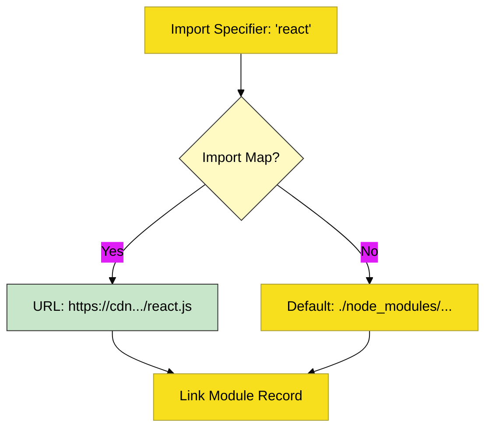

# CH-03: Static Routing (The Import Map)

> **"Rute Statis: Bagaimana Host Mengelola Pemetaan Lokasi Modul Menggunakan Struktur Resolusi yang Dapat Diprediksi SEBELUM Eksekusi."**

---

## 🌐 Source Hub
- **Parent Book**: [BK-06: Loading and Transmission](../README.md)
- **Primary Source**: [ECMA-262: HostResolveImportedModule (Clause 15.2.1.18)](https://tc39.es/ecma262/#sec-hostresolveimportedmodule)

---

## 🌓 1. Essence: The Narrative

### The Pre-Defined Path
Sebelum sebaris kode modul dijalankan, engine harus tahu persis di mana setiap file berada. **Static Routing** adalah proses di mana host (Browser atau Node.js) memetakan string specifier (seperti `./utils.js`) menjadi alamat fisik atau URL yang absolut.

### Import Maps
Salah satu implementasi modern dari rute statis adalah **Import Maps**. Mekanisme ini memungkinkan pengembang untuk mendefinisikan "alias" atau pemetaan ulang untuk modul, sehingga kode tetap bersih tanpa harus menulis path absolut yang panjang di setiap file. Karena bersifat statis, rute ini tidak bisa diubah begitu fase *Linking* dimulai.

---

## 🗺️ 2. Visual Logic: Static Resolution Flow

---

## ⚙️ 3. Spec-Internals: Host Hooks

Sistem pemuatan bersifat host-dependent, namun engine menyediakan slot untuk interaksi:
- **HostResolveImportedModule**: Hook utama yang dipanggil engine untuk meminta host menemukan modul berdasarkan *specifier*.
- **Module Map**: Struktur internal (biasanya di level host) yang memastikan modul yang sama tidak diunduh atau diparse dua kali (**Singleton Pattern**).

---

## 🧪 4. The Lab: Discovery Specimens

Eksperimen Resolusi Statis:
1.  **[examples/import_map_lab.html](../../../../../examples/import_map_lab.html)**: Demonstrasi penggunaan Import Map untuk mengalihkan rute modul di browser.
2.  **[examples/node_resolution_trace.js](../../../../../examples/node_resolution_trace.js)**: Melacak bagaimana Node.js menemukan modul melalui algoritma `exports` di `package.json`.

---

## 🧠 5. Arsitek Mindset: Kepastian Jalur
Sebagai arsitek, prioritaskan **Static Routing** untuk semua dependensi inti aplikasi Anda. Kepastian jalur yang didefinisikan secara statis memungkinkan engine melakukan optimasi maksimal, seperti *Preloading* dan *HTTP/2 Push*, yang secara signifikan meningkatkan kecepatan transmisi dan stabilitas sistem secara keseluruhan.

---
*Status: 🟢 Gold Standard | Kembali ke [BK-06](../README.md)*
