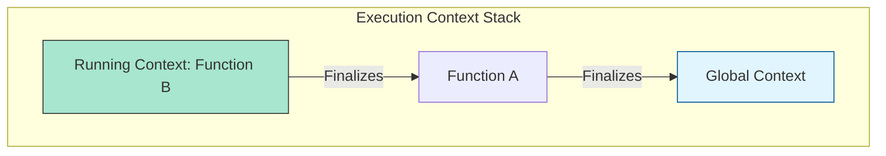

# CH-01: Execution Context Infrastructure

> **"Panggung tempat energi mengalir. `Execution Context Infrastructure` adalah struktur dasar yang menampung status eksekusi kode di dalam Hub."**

**Source Hub**: 
- [ECMA-262: Execution Contexts](https://tc39.es/ecma262/#sec-execution-contexts)

---

## 1. Konsep & Esensi

**Definisi Arsitek**:
**Execution Context** adalah abstraksi spesifikasi yang digunakan untuk melacak evaluasi runtime dari suatu kode. Pada momen tertentu, hanya satu konteks yang aktif mengeksekusi kode (Running Execution Context). Seluruh konteks dikelola dalam sebuah **Call Stack**.

**Model Mental**:
Bayangkan Hub sebagai sebuah gedung pertunjukan.
- **Execution Context**: Panggung tempat seorang aktor (kode) tampil.
- **Call Stack**: Tumpukan panggung. Panggung paling atas adalah yang sedang menyala lampunya dan aktornya sedang bergerak.

---

## 2. Visualisasi Sistem: The Call Stack

---

## 3. Mekanisme & Hubungan

### Komponen Konteks
1. **Code Evaluation State**: Berisi status untuk menangguhkan, melanjutkan, dan menghentikan eksekusi (penting untuk Generator/Async).
2. **Function**: Jika konteks ini milik fungsi, ia menyimpan objek fungsi tersebut.
3. **Realm**: Wilayah sumber daya tempat kode ini berada.
4. **ScriptOrModule**: Referensi ke file asal kode.

### Jenis-Jenis Konteks
- **Global Context**: Dibuat saat Hub pertama kali menyala. Hanya ada satu.
- **Function Context**: Dibuat setiap kali sebuah fungsi dipanggil.
- **Eval Context**: Dibuat saat fungsi `eval()` dijalankan (Gunakan dengan hati-hati!).

### Arsitek Mindset: Stack Health
- Setiap konteks memakan memori Warehouse (Heap). Tumpukan yang terlalu dalam (rekursi tanpa henti) akan menyebabkan ledakan sirkuit yang disebut **Stack Overflow**.

---

## 4. Lab Praktis
Buka file `examples/call_stack_visualizer.js` untuk melihat bagaimana Hub mendorong (push) dan menarik (pop) konteks dari stack saat melakukan panggilan fungsi bersarang.

---
*Status: [status.md](../../../../../status.md)*
