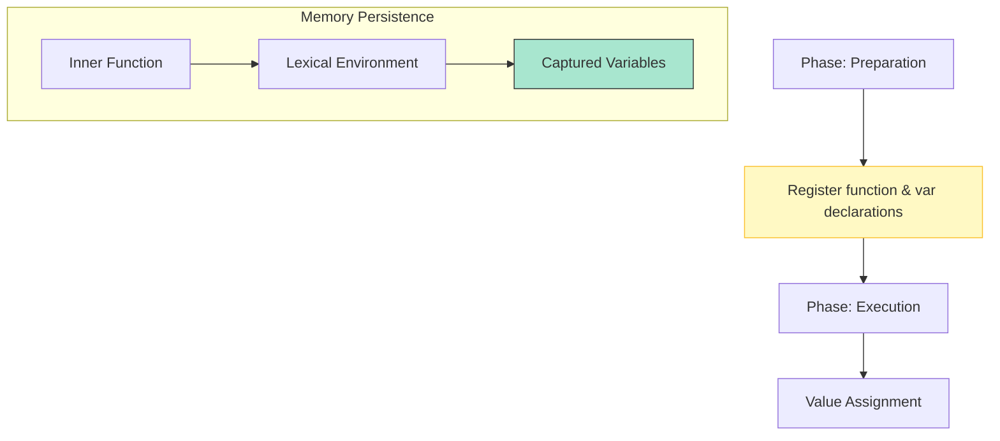

# CH-02: Runtime Lifecycle

> **"Siklus hidup energi dari persiapan hingga pelepasan. `Runtime Lifecycle` membedah bagaimana variabel didaftarkan dan bagaimana ingatan (Closure) dipertahankan."**

**Source Hub**: 
- [ECMA-262: Environment Records](https://tc39.es/ecma262/#sec-environment-records)

---

## 1. Konsep & Esensi

**Definisi Arsitek**:
Sebelum baris pertama kode dijalankan, Hub melakukan fase persiapan yang disebut **Hoisting** (pendaftaran deklarasi). Setelah itu, eksekusi berjalan baris demi baris. Jika sebuah fungsi merujuk ke variabel di luar lingkupnya, Hub menciptakan **Closure** untuk menjamin persistensi data tersebut.

**Model Mental**:
- **Hoisting**: Seperti memasang semua saklar di dinding sebelum menyambungkan kabel listriknya.
- **Closure**: Seperti baterai cadangan yang dibawa oleh fungsi. Meskipun pembangkit listrik utamanya mati (konteks selesai), fungsi tetap punya energi (akses variabel) dari baterai tersebut.

---

## 2. Visualisasi Sistem: Hoisting to Execution

---

## 3. Mekanisme & Hubungan

### Fase-Fase Kritis
1. **Creation Phase**: Hub membuat Environment Record dan mendaftarkan nama-nama variabel. Variabel `var` diinisialisasi dengan `undefined`, sedangkan `let/const` dibiarkan tidak terinisialisasi (**Temporal Dead Zone**).
2. **Execution Phase**: Nilai-nilai benar diberikan ke variabel dan logika dijalankan.
3. **Closure (Clause 9.4)**: Secara teknis, setiap fungsi di JavaScript adalah closure. Ia menyimpan referensi ke lingkungan tempat ia diciptakan, mencegah lingkungan tersebut dihapus oleh Garbage Collector jika fungsi masih bisa diakses.

### Arsitek Mindset: Memory Leaks
- Hati-hati dengan Closure. Jika Anda menyimpan variabel besar di dalam closure yang hidup selamanya (misal: di-attach ke Global), variabel tersebut tidak akan pernah dibersihkan. Pastikan untuk memutuskan sambungan (nullify) jika data tidak lagi dibutuhkan.

---

## 4. Lab Praktis
Buka file `examples/hoisting_closure_lab.js` untuk membuktikan perbedaan perilaku antara `var` dan `let` dalam fase persiapan Hub.

---
*Status: [status.md](../../../../../status.md)*
