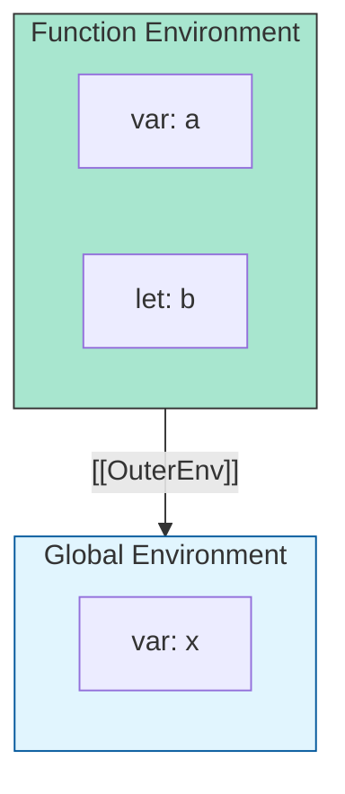

# CH-01: The Environment Hierarchy

> **"Sistem navigasi variabel. `The Environment Hierarchy` adalah jaringan Environment Records yang memungkinkan Hub menemukan lokasi penyimpanan energi (data) yang tepat."**

**Source Hub**: 
- [ECMA-262: The Environment Record Hierarchy](https://tc39.es/ecma262/#sec-the-environment-record-hierarchy)

---

## 1. Konsep & Esensi

**Definisi Arsitek**:
**Environment Record** adalah objek internal yang menyimpan pemetaan antara nama variabel dan nilainya. Setiap record memiliki referensi ke `[[OuterEnv]]` (lingkungan luar), menciptakan sebuah hirarki pohon yang kita kenal sebagai **Scope Chain**.

**Model Mental**:
Bayangkan Hub sebagai sebuah gedung kantor.
- **Environment Record**: Sebuah kantor. Di dalamnya ada laci-laci (Variabel).
- **Outer Link**: Pintu keluar menuju koridor atau kantor bos. Jika barang tidak ada di laci kantor Anda, Anda keluar pintu (Outer) untuk mencarinya di kantor yang lebih besar.

---

## 2. Visualisasi Sistem: Scope Chain Resolution

---

## 3. Mekanisme & Hubungan

### Jenis-Jenis Record
1. **Declarative Environment Record**: Digunakan untuk menyimpan deklarasi `let`, `const`, `class`, dan `function`. Sangat cepat dan efisien.
2. **Object Environment Record**: Digunakan untuk mengikat variabel ke objek nyata (misal: `window` di browser atau objek dalam pernyataan `with`).
3. **Global Environment Record**: Gabungan dari Declarative (untuk let/const global) dan Object (untuk properti objek global).
4. **Function Environment Record**: Record khusus untuk fungsi yang juga melacak nilai `this` dan `super`.

### Arsitek Mindset: Lexical Scoping
- JavaScript menggunakan **Lexical Scoping**. Artinya, "Outer Link" sebuah fungsi ditentukan saat fungsi tersebut DITULIS (didefinisikan), bukan saat dijalankan. Ini adalah dasar mengapa Closure bisa bekerja dengan sangat konsisten di dalam Hub.

---

## 4. Lab Praktis
Buka file `examples/environment_lookup_lab.js` untuk melihat bagaimana Hub menelusuri `[[OuterEnv]]` saat terjadi tabrakan nama variabel (shadowing).

---
*Status: [status.md](../../../../../status.md)*
