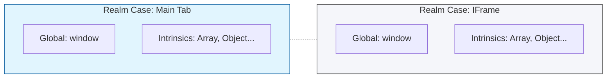

# CH-01: Execution Realms and Intrinsics

> **"Kedaulatan wilayah data. `Execution Realms and Intrinsics` mendefinisikan batas-batas isolasi tempat sebuah skrip hidup dan bernapas."**

**Source Hub**: 
- [ECMA-262: Realms](https://tc39.es/ecma262/#sec-code-realms)

---

## 1. Konsep & Esensi

**Definisi Arsitek**:
Sebelum kode dieksekusi, ia harus berada di dalam sebuah **Realm**. Realm adalah wadah yang berisi sekumpulan objek bawaan (**Intrinsics**) seperti `Object`, `Array`, `Function.prototype`, dan objek Global yang unik untuk wilayah tersebut.

**Model Mental**:
Bayangkan setiap tab di browser atau setiap kontainer di Hub sebagai sebuah negara (**Realm**). Setiap negara punya hukum dasar (Intrinsics) yang sama, tapi mereka terisolasi satu sama lain. Apa yang terjadi di Negara A tidak mempengaruhi Negara B secara langsung.

---

## 2. Visualisasi Sistem: Realm Isolation

---

## 3. Mekanisme & Hubungan

### Komponen Realm
1. **Intrinsics**: Daftar objek fundamental yang sudah terinstal secara otomatis saat Realm dibuat. Di spesifikasi, ini disebut dengan prefix `%` (misal: `%Array%`).
2. **GlobalObject**: Objek yang menjadi puncak dari scope chain (misal: `globalThis`).
3. **GlobalEnv**: Environment record yang terikat pada GlobalObject.
4. **TemplateMap**: Memori untuk menyimpan template literal yang sudah diproses.

### Arsitek Mindset: Identity Issues
- Ingatlah bahwa `Array` dari Realm A tidak sama dengan `Array` dari Realm B (`instanceof` mungkin akan gagal jika objek melintasi batas negara). Selalu gunakan `Array.isArray()` daripada `instanceof Array` untuk sirkuit yang bekerja multi-realm.

---

## 4. Lab Praktis
Buka file `examples/realm_detection_lab.js` untuk melihat bagaimana objek yang berasal dari `iframe` memiliki prototipe yang berbeda dari objek di jendela utama Hub.

---
*Status: [status.md](../../../../../status.md)*
