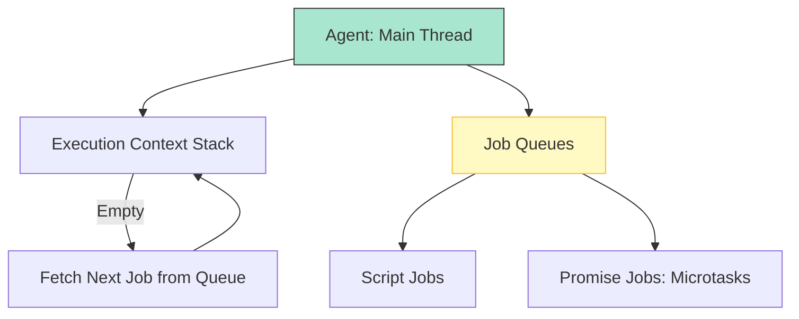

# CH-02: Agents and Job Queues

> **"Pekerja dan Antrean Tugas. `Agents and Job Queues` adalah mekanisme Hub untuk mengatur siapa yang bekerja dan kapan mereka harus berhenti."**

**Source Hub**: 
- [ECMA-262: Agents](https://tc39.es/ecma262/#sec-agents)
- [ECMA-262: Jobs and Job Queues](https://tc39.es/ecma262/#sec-jobs-and-job-queues)

---

## 1. Konsep & Esensi

**Definisi Arsitek**:
Sebuah **Agent** adalah entitas yang memiliki Execution Context Stack sendiri dan setidaknya satu Realm. **Agent Cluster** adalah sekumpulan agent yang bisa saling berbagi memori. Agar eksekusi tetap tertib, Hub menggunakan **Job Queues** untuk mengantrekan tugas-tugas yang akan dijalankan oleh agent tersebut.

**Model Mental**:
- **Agent**: Seorang teknisi di Hub.
- **Job Queue**: Daftar tugas (To-Do List) di meja teknisi. Teknisi hanya bisa mengerjakan satu hal dalam satu waktu, tapi dia punya asisten (Browser/Runtime) yang membantunya menaruh tugas baru di meja saat tugas lama selesai.

---

## 2. Visualisasi Sistem: The Agent Lifecycle

---

## 3. Mekanisme & Hubungan

### Job Queues (Clause 9.5)
1. **Script Jobs**: Eksekusi awal dari sebuah file script atau module.
2. **Promise Jobs**: Tugas mikro yang harus dijalankan SEGERA setelah tugas saat ini selesai, tapi sebelum tugas makro berikutnya (misal: `.then()` pada Promise).
3. **Execution Order**: Agent akan mengosongkan antrean Promise Jobs sepenuhnya sebelum memproses input pengguna atau event berikutnya.

### Arsitek Mindset: Concurrency and Threading
- JavaScript secara teknis adalah single-threaded per-agent. Jika Anda ingin melakukan "Multi-threading", Anda harus membuat Agent baru (Web Workers). Mereka bisa berkomunikasi tapi tidak bisa berbagi stack eksekusi yang sama secara langsung.

---

## 4. Lab Praktis
Buka file `examples/event_loop_race.js` untuk melihat simulasi urutan eksekusi antara kode sinkron, Mikro-tugas (Promise), dan Makro-tugas (setTimeout) di dalam Hub.

---
*Status: [status.md](../../../../../status.md)*
