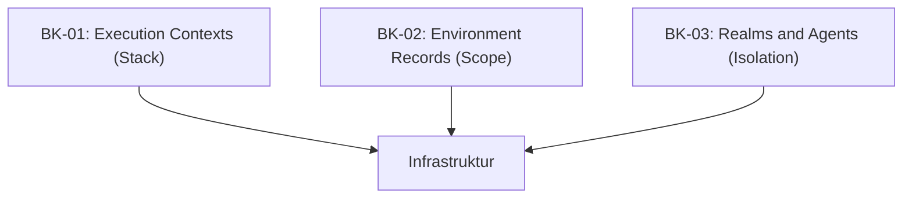

# SR-04: Executable Code and Contexts (The Runtime Infra)

> **"Infrastruktur tempat energi mengalir secara dinamis. SR-04 membedah 'Kode Eksekusi dan Konteks' (The Runtime Infra)—sistem pengelolaan stack, scope, dan isolasi realm."**

**Source Hub**: 
- [ECMA-262: Executable Code and Execution Contexts](https://tc39.es/ecma262/#sec-executable-code-and-execution-contexts)

---

## 🏗️ The 3 Pillars of Runtime Infrastructure

---

## Koleksi Buku:
1.  **[BK-01: Execution Contexts](./BK-01_ExecutionContexts/)**: Komponen Call Stack, Hoisting, dan siklus hidup konteks.
2.  **[BK-02: Environment Records](./BK-02_EnvironmentRecords/)**: Struktur internal Scope, Declarative vs Object records.
3.  **[BK-03: Realms and Agents](./BK-03_RealmsAndAgents/)**: Wilayah isolasi data (Realms) dan entitas eksekusi (Agents/Jobs).

---
*Status: [status.md](../../status.md) | Back to [RAK-04](../README.md)*
