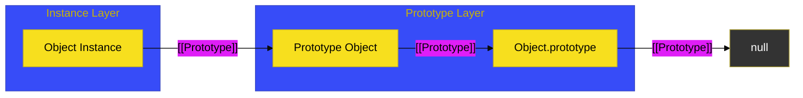

# CH-01: The Proto-Linkage Architecture

> **"Rantai Tak Terlihat: Membedah Jalur `[[Prototype]]` yang Menghubungkan Setiap Objek ke Sumber Warisannya."**

---

## 🌐 Source Hub
- **Parent Book**: [BK-02: Prototype Inheritance](../README.md)
- **Primary Source**: [ECMA-262: Ordinary Object Internal Methods (Clause 10.1)](https://tc39.es/ecma262/#sec-ordinary-object-internal-methods-and-slots)

---

## 🌓 1. Essence: The Narrative

### The Internal Slot
Setiap objek biasa (Ordinary Object) di JavaScript memiliki slot internal bernama **`[[Prototype]]`**. Slot ini bukan properti biasa; ia adalah referensi memori langsung ke objek lain (atau `null`). Inilah fondasi dari sistem pewarisan delegasi JavaScript.

### Linkage vs Property
Penting untuk membedakan antara:
- **`[[Prototype]]`**: Slot internal (diakses via `Object.getPrototypeOf`).
- **`prototype`**: Properti pada fungsi konstruktor yang digunakan sebagai cetak biru untuk objek baru.
- **`__proto__`**: Aksesor legacy (deprecated) untuk slot internal.

---

## 🗺️ 2. Visual Logic: The Linkage Map

---

## ⚙️ 3. Spec-Internals: Immutable Prototype

Beberapa objek memiliki prototipe yang tidak dapat diubah (**Immutable Prototype Exotic Objects**), seperti `Object.prototype` atau objek modul. Secara internal, metode **`[[SetPrototypeOf]]`** pada objek-objek ini akan selalu mengembalikan `false` atau melempar error jika Anda mencoba mengubah jalurnya.

---

## 🧪 4. The Lab: Discovery Specimens

Eksperimen Tautan Prototipe:
1.  **[examples/prototype_link_verify.js](../../../../../examples/prototype_link_verify.js)**: Verifikasi kesamaan referensi antara `instance.__proto__` dan `Constructor.prototype`.
2.  **[examples/immutable_proto_test.js](../../../../../examples/immutable_proto_test.js)**: Mencoba mengubah prototipe pada objek yang dilarang oleh spesifikasi.

---

## 🧠 5. Arsitek Mindset: Desain Delegasi
Sebagai arsitek, pandanglah prototipe sebagai **Sistem Delegasi**, bukan pewarisan kelas tradisional (Copy-on-Inherit). Objek tidak membawa salinan metode dari induknya; mereka hanya memiliki "peta" untuk menemukannya jika dibutuhkan. Desain ini sangat hemat memori karena ribuan instance dapat berbagi satu set metode yang sama di objek prototipe tunggal.

---
*Status: 🟢 Gold Standard | Kembali ke [BK-02](../README.md)*
