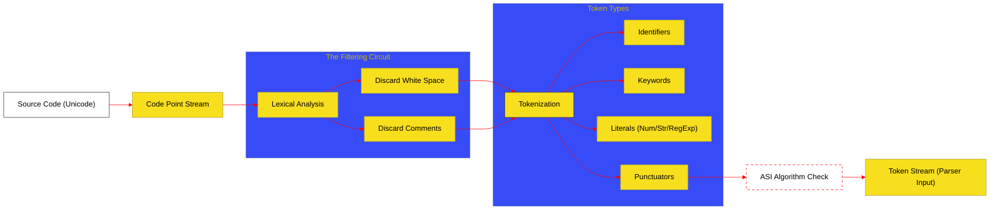

# BK-01: Lexical Grammar (Clause 11-12)

> **"Pintu Gerbang Persepsi: Bagaimana Hub Mendiagnosis Teks Mentah Menjadi Unit Makna yang Dapat Dieksekusi."**

---

## 🌓 1. Essence: The Narrative

### Dual Definition
- **Formal**: Spesifikasi teknis mengenai pemindaian (scanning) karakter Unicode, penghapusan noise (White Space/Comments), dan pengelompokan karakter menjadi urutan **Tokens** (Keyword, Punctuator, Literal) berdasarkan konteks leksikal.
- **Analogi**: Bayangkan sebuah **Mesin Sortir Surat**. Surat-surat mentah masuk dalam jumlah ribuan. Mesin harus mengenali mana yang merupakan alamat (Identifier), mana yang merupakan prangko (Keyword), dan mana yang sekadar kertas pengisi (White Space). Jika mesin salah membaca satu simbol, seluruh sistem logistik bisa terhenti (**Syntax Error**).

---

## 🗺️ 2. Visual Logic: The Lexing Pipeline

Proses transformasi dari karakter mentah menjadi token leksikal:

---

## 🏛️ 3. Strategic Chapters (Levels 5)

Setiap bab di bawah ini membedah sirkuit spesifik dalam navigasi leksikal:

1.  **[CH-01: Tokenization and Punctuators](./CH-01_Tokenization/)**
    *Pemisahan White Space, Line Terminators, dan pembuatan unit dasar Identifier.*
2.  **[CH-02: Literals and Template Atoms](./CH-02_Literals/)**
    *Mekanika internal pembentukan angka, string, regex, dan atom template.*
3.  **[CH-03: Automatic Semicolon Insertion (ASI)](./CH-03_ASI/)**
    *Algoritma sakral Clause 12.9 yang menentukan insersi virtual titik koma.*

---

## 🧠 4. Under-the-hood: The Context Sensitivity
Di level engine, Lexical Grammar JavaScript bersifat **Context-Sensitive**. Contoh paling ekstrem adalah karakter `/`. Engine harus memutuskan apakah `/` adalah operator pembagian (Division) atau awal dari Regular Expression Literal. Keputusan ini diambil berdasarkan **Goal Symbol** (misal: `InputElementDiv` vs `InputElementRegExp`) yang diberikan oleh Parser kepada Lexer secara real-time.

---

## 🎖️ 5. The Gold Standard Checklist
- [x] **Spec-Alignment**: Sinkronisasi dengan ECMA-262 Clause 11-12.
- [x] **Visual Logic**: Mermaid diagram untuk pipeline laring.
- [x] **Mental Model**: Analogi "Mesin Sortir Surat".
- [x] **Spec-Reference**: Tautan langsung ke Clause teknis.

---
*Buku Status: [x] Complete | [status.md](../../docs/status.md) | Kembali ke [SR-05](../README.md)*
