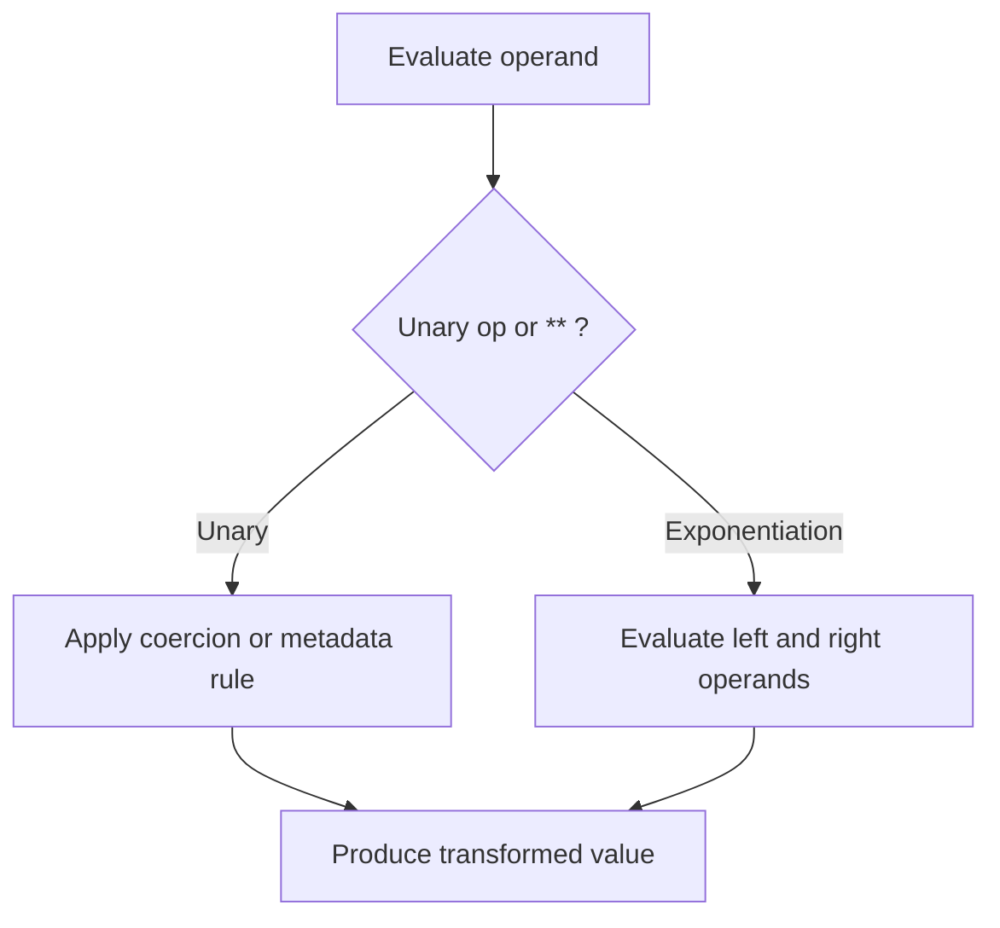

# CH-01: Unary and Exponentiation

> **"Operator unary mengubah satu operand, sementara exponentiation membangun hasil daya dengan aturan associativity khusus."**

**Source Hub**:
- [ECMA-262: Unary Operators](https://tc39.es/ecma262/#sec-unary-operators)
- [ECMA-262: Exponentiation Operator](https://tc39.es/ecma262/#sec-exp-operator)

---

## Mekanisme Inti

---

## Fokus Audit
1. `typeof`, `delete`, `void`, `!`, `~`, unary `+`, dan unary `-` punya efek yang berbeda terhadap operand.
2. `**` bersifat right-associative dan tidak bisa dibaca seperti operator aritmatika biasa.
3. Numeric conversion tetap menentukan hasil akhir sebelum operator menghasilkan value baru.

---

## Lab Praktis

Buka file `examples/01_unary_exponentiation_lab.js` untuk melihat efek unary numeric conversion dan associativity `**`.

---
*Status: [x] Complete | [status.md](../../../docs/status.md)*
