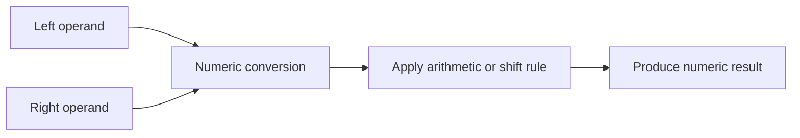

# CH-02: Arithmetic and Shift

> **"Operator aritmatika dan shift mengubah representasi numerik operand secara langsung."**

**Source Hub**:
- [ECMA-262: Multiplicative Operators](https://tc39.es/ecma262/#sec-multiplicative-operators)
- [ECMA-262: Additive Operators](https://tc39.es/ecma262/#sec-additive-operators)
- [ECMA-262: Shift Operators](https://tc39.es/ecma262/#sec-shift-operators)

---

## Mekanisme Inti

---

## Fokus Audit
1. `+` perlu dibedakan antara numeric addition dan string concatenation.
2. Shift operators memaksa integer-style behavior sebelum menggeser bit.
3. Coercion menjadi bagian inti dari operator ini, bukan efek samping.

---

## Lab Praktis

Buka file `examples/01_arithmetic_shift_lab.js` untuk membandingkan penjumlahan numerik, konkatenasi string, dan pergeseran bit.

---
*Status: [x] Complete | [status.md](../../../docs/status.md)*
