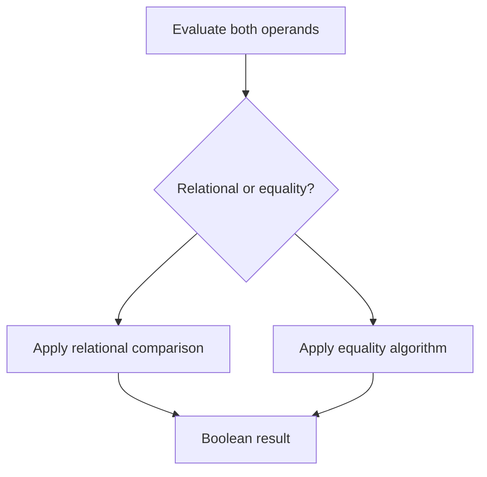

# CH-03: Relational and Equality

> **"Operator pembanding menentukan apakah dua operand berdiri dalam relasi atau kesetaraan tertentu."**

**Source Hub**:
- [ECMA-262: Relational Operators](https://tc39.es/ecma262/#sec-relational-operators)
- [ECMA-262: Equality Operators](https://tc39.es/ecma262/#sec-equality-operators)

---

## Mekanisme Inti

---

## Fokus Audit
1. `==` dan `===` memakai algoritma yang berbeda, bukan sekadar tingkat keketatan berbeda.
2. `in` dan `instanceof` harus dibaca sebagai relational operators dengan jalur internal method khusus.
3. Comparison semantics bergantung pada conversion path yang dipilih algoritmanya.

---

## Lab Praktis

Buka file `examples/01_relational_equality_lab.js` untuk melihat perbedaan `==`, `===`, `in`, dan `instanceof`.

---
*Status: [x] Complete | [status.md](../../../docs/status.md)*
