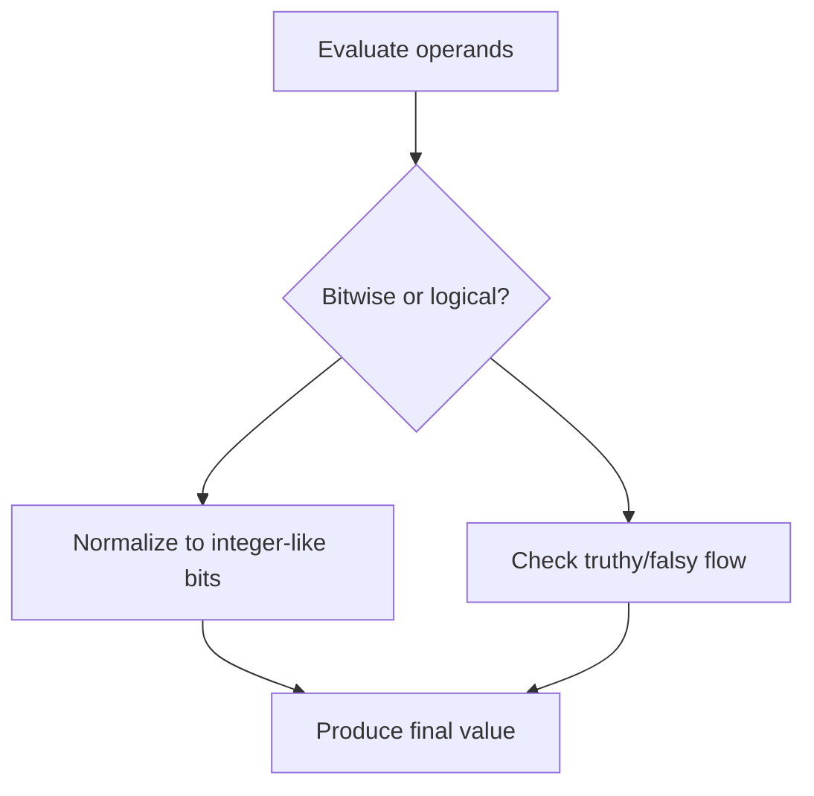

# CH-04: Bitwise and Logical

> **"Operator bitwise dan logical memproses nilai pada level bit atau memilih jalur truthy-falsy dasar."**

**Source Hub**:
- [ECMA-262: Binary Bitwise Operators](https://tc39.es/ecma262/#sec-binary-bitwise-operators)
- [ECMA-262: Binary Logical Operators](https://tc39.es/ecma262/#sec-binary-logical-operators)

---

## Mekanisme Inti

---

## Fokus Audit
1. Bitwise operators mendorong operand ke representasi integer-like sebelum evaluasi.
2. Logical operators tidak selalu mengembalikan boolean; mereka bisa mengembalikan salah satu operand.
3. Short-circuit detail akan diperdalam lagi di `BK-07`.

---

## Lab Praktis

Buka file `examples/01_bitwise_logical_lab.js` untuk membandingkan hasil operator bitwise dan logical pada operand yang sama.

---
*Status: [x] Complete | [status.md](../../../docs/status.md)*
